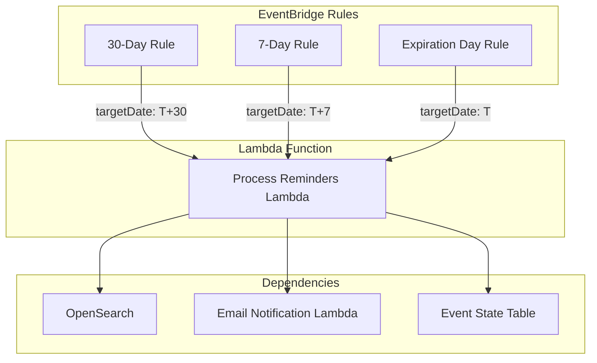

# Privilege Expiration Reminder Notification System

## Architecture Overview



## Phased Implementation Plan

### Phase 1 — OpenSearch query generator + handler skeleton

- **Implement**: `iterate_privileges_by_expiration_date()` generator (page-on-demand) and a minimal `process_expiration_reminders()` handler that wires together: OpenSearch → per-provider processing loop → metrics output.
- **Add tests**:
  - Unit tests for the generator pagination behavior (multiple pages, empty results, last page) using mocked OpenSearch responses.
  - Unit tests for “extract privileges expiring on targetDate” from a provider document (including nested `inner_hits` vs full privileges list, if applicable).
- **Run locally**:
  - `python -m pytest backend/compact-connect/lambdas/python/expiration-reminders/tests`

### Phase 2 — Email template + Python email client call

- **Implement**:
  - Add `privilegeExpirationReminder` template to the Node email service and an exported method to send it.
  - Add `send_privilege_expiration_reminder_email()` to `cc_common.email_service_client.EmailServiceClient` to invoke the email service lambda with the new template payload.
- **Add tests**:
  - Node unit tests verifying template variable validation + rendered output shape for `privilegeExpirationReminder`.
  - Python unit test verifying the `EmailServiceClient` payload for `privilegeExpirationReminder` (template name, recipientType `SPECIFIC`, variables).
- **Run locally**:
  - `python -m pytest backend/compact-connect/lambdas/python/common/tests`
  - Run the Node email notification service unit tests (from `backend/compact-connect/lambdas/nodejs/`, using the repo’s standard test command for that package).

### Phase 3 — Idempotency tracking (EventStateTable)

- **Implement**: `ExpirationReminderTracker` (or extend existing tracker pattern) so the handler can:
  - Check “already notified for provider + expiration_date (+ compact)” before sending.
  - Record success after sending so retries do not duplicate emails.
- **Add tests**:
  - Unit tests for tracker keying and “already sent” behavior.
  - Handler unit tests covering: already-sent → skipped, missing email → skipped, send failure → failed + recorded (as applicable).
- **Run locally**:
  - `python -m pytest backend/compact-connect/lambdas/python/expiration-reminders/tests`

### Phase 4 — CDK stack + scheduling + alarms (incl. duration alarm)

- **Implement**:
  - `ExpirationReminderStack` with the Lambda, 3 EventBridge rules (30/7/0 days), and log retention.
  - CloudWatch alarms:
    - Lambda errors/throttles (as appropriate).
    - **Duration alarm**: triggers if Lambda execution duration exceeds **10 minutes** (with 15-minute Lambda timeout).
  - Integrate stack into `backend/compact-connect/pipeline/backend_stage.py` (consistent with other optional stacks).
- **Add tests**:
  - CDK assertions tests validating: rules exist, Lambda timeout is 15 minutes, and the duration alarm threshold is 10 minutes.
- **Run locally**:
  - `python -m pytest backend/compact-connect/tests/app -k expiration_reminder`

## Implementation Components

### 1. New Stack: ExpirationReminderStack

Create [`stacks/expiration_reminder_stack/__init__.py`](backend/compact-connect/stacks/expiration_reminder_stack/__init__.py)

**Dependencies:**

- `PersistentStack` - provider table, email service lambda, encryption key, alarm topic
- `EventStateStack` - notification tracking table
- `SearchPersistentStack` - OpenSearch domain for querying privileges by expiration date

**Resources created:**

- Lambda function for processing reminders (15-minute timeout to handle all providers in single execution)
- Three EventBridge rules (30-day, 7-day, day-of)
- CloudWatch alarm for Lambda execution time (triggers if execution exceeds 10 minutes)
- CloudWatch alarms for Lambda failures
- Log groups with appropriate retention

**Note on execution time:** The Lambda is configured with a 15-minute timeout. A CloudWatch alarm will trigger if the execution time ever exceeds 10 minutes, alerting us before we approach the timeout limit. This allows us to monitor if we need to revisit the single-execution approach in the future.

### 2. New Lambda: expiration-reminders

Create new lambda directory: `lambdas/python/expiration-reminders/`

**Handler:** `handlers/expiration_reminders.py`

```python
def process_expiration_reminders(event: dict, context):
    """
    Input:
        {
            "targetDate": "2026-02-16",      # Expiration date to process
            "daysBefore": 30,                # Days before expiration (30, 7, or 0)
            "scheduledTime": "2026-01-17...", # When rule triggered (for logging)
        }

    Output:
        {
            "targetDate": "2026-02-16",
            "daysBefore": 30,
            "metrics": { "sent": N, "skipped": N, "failed": N, "alreadySent": N, "noEmail": N }
        }
    """
```

**Core logic:**

1. Query OpenSearch for active privileges expiring on `targetDate`
   - Use `iterate_privileges_by_expiration_date()` generator which handles pagination internally
   - The generator yields provider documents one at a time, fetching subsequent pages on demand
   - This avoids loading all results into memory at once
2. As each provider document is yielded from the generator:
   - Extract privileges expiring on `targetDate` from the provider document
   - Check `EventStateTable` if notification already sent for this provider/date
   - Skip if already sent (idempotency)
   - Get provider's registered email from provider record
   - Skip if no registered email
   - Send email via Email Notification Service Lambda (consolidating all expiring privileges for this provider)
   - Record notification sent in `EventStateTable`

3. Return metrics summary with counts of sent, skipped, and failed notifications

**Note:** The Lambda processes all providers in a single execution. OpenSearch pagination happens within the Lambda function (not across multiple invocations) using a generator that fetches pages on demand, keeping memory usage low.

### 3. Email Template Addition

Update [`lambdas/nodejs/email-notification-service/lambda.ts`](backend/compact-connect/lambdas/nodejs/email-notification-service/lambda.ts)

Add new case for `privilegeExpirationReminder` template.

Update [`lambdas/nodejs/lib/email/email-notification-service.ts`](backend/compact-connect/lambdas/nodejs/lib/email/email-notification-service.ts)

Add `sendPrivilegeExpirationReminderEmail()` method.

**Template variables:**

- `providerFirstName` - Practitioner's first name
- `expirationDate` - The actual expiration date (formatted nicely)
- `privileges` - Array of `{ jurisdiction, licenseType, privilegeId }`

**Email content:**

- Subject: "Your Compact Connect Privileges Expire on [Date]"
- Body: Lists all privileges expiring on that date with jurisdiction and license type

### 4. Python Email Client Extension

Update [`lambdas/python/common/cc_common/email_service_client.py`](backend/compact-connect/lambdas/python/common/cc_common/email_service_client.py)

Add `send_privilege_expiration_reminder_email()` method following existing patterns.

### 5. Notification Tracking

Use existing `EventStateTable` with new key pattern (implemented in `cc_common.event_state_client`):

```
pk: {compact}#EXPIRATION_REMINDER#{provider_id}
sk: {event_type}#{expiration_date}
ttl: 90 days after expiration (auto-cleanup)
```

Where `event_type` is one of:
- `privilege.expiration.30day`
- `privilege.expiration.7day`
- `privilege.expiration.dayOf`

This allows tracking each reminder type (30-day, 7-day, day-of) independently per provider/expiration date.

`ExpirationReminderTracker` class in `cc_common.event_state_client` provides the interface for checking/recording sent notifications.

### 6. OpenSearch Query Helper

Add generator method to find privileges by expiration date. This method handles OpenSearch pagination internally and yields results one at a time, fetching subsequent pages on demand:

```python
def iterate_privileges_by_expiration_date(compact: str, expiration_date: date):
    """Generator that yields provider documents with privileges expiring on a specific date.

    Uses search_after pagination internally, fetching pages on demand as results are consumed.
    This keeps memory usage low by not loading all results into memory at once.

    Yields provider documents (dict) one at a time. Each document contains the provider
    data and a nested privileges array with matching privileges.

    :param compact: Compact identifier
    :param expiration_date: Date to match against privilege expiration dates
    :yield: Provider document dict with matching privileges
    """
    index_name = f'compact_{compact}_providers'
    search_after = None
    current_page_hits = []
    is_last_page = False

    while True:
        # Fetch next page if current page is exhausted
        if not current_page_hits:
            # If we've already processed the last page, we're done
            if is_last_page:
                break

            search_body = {
                "query": {
                    "nested": {
                        "path": "privileges",
                        "query": {
                            "bool": {
                                "must": [
                                    {"term": {"privileges.dateOfExpiration": expiration_date.isoformat()}},
                                    {"term": {"privileges.status": "active"}}
                                ]
                            }
                        },
                        "inner_hits": {"size": 100}
                    }
                },
                "sort": [{"providerId": "asc"}],  # Required for search_after pagination
                "size": 100
            }

            if search_after:
                search_body["search_after"] = search_after

            response = opensearch_client.search(index_name=index_name, body=search_body)
            hits = response.get('hits', {}).get('hits', [])

            if not hits:
                # No more results
                break

            # Store hits as a list that we'll pop from
            current_page_hits = hits

            # If we got fewer results than requested, this is the last page
            if len(hits) < 100:
                is_last_page = True
            else:
                # Get sort values from last hit for next page (before we start popping)
                last_hit = hits[-1]
                search_after = last_hit.get('sort')

        # Pop and yield next result from current page
        # Using pop(0) removes the item from the list, freeing memory as we process
        hit = current_page_hits.pop(0)
        yield hit['_source']
```

### 7. Backend Stage Integration

Update [`pipeline/backend_stage.py`](backend/compact-connect/pipeline/backend_stage.py)

Add `ExpirationReminderStack` instantiation, conditional on `self.persistent_stack.hosted_zone` (same as `NotificationStack` and `ReportingStack`).

## File Structure

```
backend/compact-connect/
├── stacks/
│   └── expiration_reminder_stack/
│       └── __init__.py                    # New stack definition
├── lambdas/
│   ├── python/
│   │   └── expiration-reminders/          # New lambda package
│   │       ├── handlers/
│   │       │   └── expiration_reminders.py
│   │       ├── requirements.in
│   │       ├── requirements.txt
│   │       ├── requirements-dev.in
│   │       ├── requirements-dev.txt
│   │       └── tests/
│   │           └── (unit tests)
│   └── nodejs/
│       ├── email-notification-service/
│       │   └── lambda.ts                  # Add template case
│       └── lib/email/
│           └── email-notification-service.ts  # Add email method
└── pipeline/
    └── backend_stage.py                   # Add stack to stage
```

## Testing Strategy

1. **Unit tests** for the Lambda handler with mocked OpenSearch and email service
2. **Manual testing** via AWS Console - invoke Lambda directly with specific `targetDate`:

```json
{
  "targetDate": "2026-02-16",
  "scheduledTime": "2026-01-20T10:00:00Z"
}
```

The notification tracker ensures no duplicate emails are sent when retrying.
