# Backend design

Look here for continued documentation of the back-end design, as it progresses.

## Table of Contents
- **[Compacts and Jurisdictions](#compacts-and-jurisdictions)**
- **[License Ingest](#license-ingest)**
- **[User Architecture](#user-architecture)**
- **[Practitioner Data Model](#practitioner-data-model)**
- **[Multi-State License Model / Privilege Generation](#multi-state-license-model--privilege-generation)**
- **[Notifications](#notifications)**
- **[DynamoDB Tables](#dynamodb-tables)**
- **[Advanced Data Search](#advanced-data-search)**
- **[CI/CD Pipelines](#cicd-pipelines)**
- **[Audit Logging](#audit-logging)**

## Compacts and Jurisdictions

The CompactConnect system supports multiple licensure compacts and, within each compact, multiple jurisdictions. For
the Social Work Compact specifically, the supported jurisdictions are the 50 states, the District of Columbia, Guam,
the Commonwealth of the Northern Mariana Islands, and the U.S. Virgin Islands — see the jurisdiction-to-license-type
recognition mapping in
[license_recognition_util.py](../../lambdas/python/common/cc_common/license_recognition_util.py) for the authoritative
list.

### Adding a compact to CompactConnect

When a new compact joins CompactConnect, some configuration has to be done to add them to the system. First, a new
entry has to be added to the list of supported compacts, found in [cdk.json](../../cdk.json). Each compact is
represented there with an abbreviation, which determines how the compact will be represented in the API as well as
in its corresponding Oauth2 access scopes. Because of the way that the scopes are represented, the compact abbreviation
must not overlap with any jurisdiction abbreviations (which correspond to the jurisdictions' USPS postal abbreviations).
**Since postal abbreviations are all two letters, make a point to choose a compact abbreviation that is at least four
letters for clarity and to avoid naming conflicts.** Note that the compact abbreviations in this system do no
necessarily need to match the ones used publicly by those compacts. It only affects how the compact is represented
in the REST API and its access token scopes.

Once the supported compacts have been updated and the configuration change deployed, a CompactConnect admin can create
a user for the compact's executive director, who then will be allowed to start creating users for the boards of each
jurisdiction within the compact.

## License Ingest
[Back to top](#backend-design)

To facilitate sharing of license data across states, compact member jurisdictions will periodically upload data for
eligible licensees to CompactConnect. See [license-ingest-digram.pdf](./license-ingest-diagram.pdf) for an illustration
of the ingest chain architecture. Board admins and/or information systems have two primary methods of upload:
- A direct HTTP POST method, where they can synchronously validate up to 100 licenses per call.
- A bulk-upload mechanism that allows submitting of a CSV file with a much larger number of licenses for asynchronous
  validation and ingest.

### SSN Access Controls
The system implements strict controls for SSN access:

1. **Dedicated SSN Table**: All SSN data is stored in a dedicated DynamoDB table with strict access controls and
   customer-managed KMS encryption.
2. **Comprehensive Audit Logging**:
   - All SSN data access through the application is logged with user identity, timestamp, and access context
   - Direct database access is independently tracked through our secure audit logging system (see
     [Audit Logging](#audit-logging))
3. **Restricted Operations**: The SSN table policy explicitly denies batch operations to prevent mass data extraction.

#### SSN Role-Based Access
Three specialized IAM roles control access to SSN data:
   - `license_upload_role`: Used by upload handlers to encrypt SSN data for the preprocessing queue.
   - `ingest_role`: Used by the license preprocessor to create and update SSN records in the SSN table.

### Ingest Flow

The ingest process begins when license data enters the system through one of the following two methods:

#### HTTP POST
   Clients can directly post an array of up to 100 licenses to the license data API. If they do this, the API will
validate each license synchronously and return any validation errors to the client. If the licenses are valid,
the API will send the validated licenses to the preprocessing queue.

#### Bulk Upload
   To upload a bulk license file, clients use an authenticated GET endpoint to receive a
[presigned url](https://docs.aws.amazon.com/AmazonS3/latest/userguide/using-presigned-url.html) that will allow the
client to directly upload their file to s3. Once the file is uploaded to s3, an s3 event triggers a lambda to read and
validate each license in the data file, then fire either a success or failure event to the license data event bus.

Both of these upload methods will place license records containing full SSNs in an SQS queue which is encrypted with the
same KMS key as the SSN table to invoke the license preprocessor Lambda function.

#### **License Preprocessing**:
   - A Lambda function processes messages from the encrypted queue
   - For each license, it:
     - Extracts the full SSN from the license data and creates/updates a record in the SSN table, which becomes
       associated with a provider ID. This provider id is unique to the CompactConnect system and is used to generate
       provider records within the system.
     - After creating the SSN record, the lambda Publishes an event to the data event bus with the license data
       (minus the full SSN)

   The event bus then triggers the license data processing Lambda function.

#### **License Data Processing**:
   - The data event bus receives the sanitized license events
   - Downstream processors create provider and license records in the provider table, using only the last four digits
     of the SSN

This architecture ensures that SSN data is protected throughout the ingest process while still allowing the system to
associate licenses with the correct providers across jurisdictions.

### All-Licensee Ingestion, Including Single-State Licensees

The ingest pipeline described above processes **every uploaded licensee record identically**, regardless of the
license's `licenseScope` (`single-state` or `multi-state`, see [License Scopes](#license-scopes)). It is expected that jurisdictions will upload all single-state and multi-state licenses associated with each provider that they intend to upload data for.

Single-state-only licensees are fully ingested and stored as `license` records. However, because privilege generation requires a **paired** multi-state and
single-state license in the same jurisdiction and license type (see
[Privilege Runtime Generation for Multi-State Licenses](#privilege-runtime-generation-for-multi-state-licenses)), a
single-state-only licensee will never have privileges generated for them. Their data is still valuable to the
system and to other member states, since it establishes the practitioner's licensure record and status within the
compact even though they are not (yet) authorized to practice in other jurisdictions.

If a jurisdiction uploads a multi-state license as compact-eligible while its paired single-state license in the same jurisdiction is already ineligible (inactive, expired, or encumbered), the multi-state license is **still persisted** rather than rejected, and a
`license.validation-error` event is published so the uploading jurisdiction can be notified of the mismatch (see
`_check_for_multi_state_single_state_eligibility_validation_error` in
[ingest.py](../../lambdas/python/provider-data-v1/handlers/ingest.py)). This ensures that licensee data is always
accepted and ingested even in cases where eligibility for compact privileges cannot yet be fully confirmed.

Re-uploading that same license (determined by providerId, jurisdiction, licenseType, and licenseScope) updates the existing record in place (rather than creating a duplicate), and, when relevant fields changed, creates a `licenseUpdate` history record categorized as a `renewal` (when the expiration date moved forward — i.e., the jurisdiction reissued the license for a new term), a `deactivation` (when the jurisdiction reports the license as inactive), or `other` (for any other changed field).


## User Architecture
[Back to top](#backend-design)

Authentication with the CompactConnect backend is controlled through OAuth2 via
[AWS Cognito User Pools](https://github.com/csg-org/CompactConnect). The Social Work application uses a single
Cognito user pool for human access: [Staff Users](#staff-users). Jurisdiction license upload integrations use [machine-to-machine app clients](#machine-to-machine-app-clients).

### Staff Users

Staff users will be granted a variety of different permissions, depending on their role. Read permissions are granted
to a user for an entire compact or not at all. Data writing and user administration permissions can each be granted to
a user per compact/jurisdiction combination. All of a compact user's permissions are stored in a DynamoDB record that is
associated with their own Cognito user id. That record will be used to generate scopes in the Oauth2 token issued to
them on login. See [Implementation of scopes](#implementation-of-scopes) for a detailed explanation of the design for
exactly how permissions will be represented by scopes in an access token. See
[Implementation of permissions](#implementation-of-permissions) for a detailed explanation of the design for exactly
how permissions are stored and translated into scopes.

#### Common Staff User Types
The system permissions are designed around several common types of staff users. It is important to note that these user
types are an abstraction which do not correlate directly to specific roles or access within the system. All access is
controlled by the specific permissions associated with a user. Still, these abstractions are useful for understanding
the system's design.

##### Compact Executive Directors and Staff

Compact ED level staff will typically be granted the following permissions at the compact level:

- `admin` - grants access to administrative functions for the compact, such as creating and managing users and their
  permissions.
- `readPrivate` - grants access to view all data for any licensee within the compact.

With the `admin` permission, they can grant other users the ability to write data for a particular
jurisdiction and to create more users associated with a particular jurisdiction. They can also delete any user within
their compact, so long as that user does not have permissions associated with a different compact, in which case the
permissions from the other compact would have to be removed first.

Users granted any of these permissions will also be implicitly granted the `readGeneral` scope for the associated
compact, which allows them to read any licensee data within that compact that is not considered private.

##### Board Executive Directors and Staff

Board ED level staff may be granted the following permissions at a jurisdiction level:

- `admin` - grants access to administrative functions for the jurisdiction, such as creating and managing users and
their permissions.
- `write` - grants access to write data for their particular jurisdiction (ie uploading license information).
- `readPrivate` - grants access to view all information for any licensee that has either a license or privilege within
  their jurisdiction (except the full SSN. This permission allows viewing the last 4 digits of the SSN).

#### Implementation of Scopes

AWS Cognito integrates with API Gateway to provide
[authorizers](https://docs.aws.amazon.com/apigateway/latest/developerguide/apigateway-integrate-with-cognito.html)
on an API that can verify the tokens issued by a given User Pool and to protect access based on scopes belonging to
[Resource Servers](https://docs.aws.amazon.com/cognito/latest/developerguide/cognito-user-pools-define-resource-servers.html)
associated with that User Pool.

The Staff Users pool implements authorization using resource servers configured for each jurisdiction and compact. This
design allows for efficient management of permissions while staying within AWS Cognito's limits (100 scopes per
resource server, 300 resource servers per user pool).

Each jurisdiction has its own resource server with scopes that control access to that jurisdiction's data across
different compacts. For example, the Kentucky (KY) resource server would have scopes like:

```
ky/socw.admin
ky/socw.write
ky/socw.readPrivate
```

If a user has the `ky/socw.admin` scope, for example, they will be able to perform any admin action within the Kentucky
jurisdiction within the socw compact.

Each compact also has its own resource server with compact-wide scopes, which are used to control access to data across
all jurisdictions within a compact:

```
socw/admin
socw/readGeneral
socw/readPrivate
```

If a user has the `socw/admin` scope, for example, they will be able to perform any admin action for any jurisdiction
within the compact.

Staff users in a compact will also be implicitly granted the `readGeneral` scope for the associated compact,
which allows them to read any licensee data that is not considered private.

In addition to the `readGeneral` scope, there is a `readPrivate` scope, which can be granted at both compact and
jurisdiction levels. This permission indicates the user can read all of a compact's provider data (licenses and
privileges), so long as the provider has at least one license or privilege within their jurisdiction or the user has
compact-wide permissions.

#### Implementation of Permissions

Staff user permissions are stored in a dedicated DynamoDB table, which has a single record for each user
and includes a data structure that details that user's particular permissions. Cognito allows for a lambda to be
[invoked just before it issues a token](https://docs.aws.amazon.com/cognito/latest/developerguide/user-pool-lambda-pre-token-generation.html).
We use that feature to retrieve the database record for each user, parse the permissions data and translate those
into scopes, which will be added to the Cognito token. The lambda generates scopes based on both compact-level and
jurisdiction-level permissions, ensuring consistent access control at token issuance.

#### Machine-to-machine app clients

See README under the [app_clients](../../app_clients/README.md) directory for more information about how
machine-to-machine app clients are configured and used in the system.


## Practitioner Data Model
[Back to top](#backend-design)

CompactConnect uses a single noSQL (DynamoDB) table design for storing provider (practitioner) data, following the
[single table design](https://aws.amazon.com/blogs/database/single-table-vs-multi-table-design-in-amazon-dynamodb/)
pattern. While there are other DynamoDB tables used for tracking various information needed for the system to operate (see
[DynamoDB Tables](#dynamodb-tables) for the full inventory), this particular section covers the **Provider Table** and the records stored related to practitioners. The Provider Table design optimizes for:

1) **Compact-Level Partitioning**: Data is always partitioned by compact, ensuring that queries never return records
   from multiple compacts. This enforces a deliberate separation of data across all layers - UI, API, and database -
   where users must explicitly specify which compact's data they're accessing.

2) **Query Efficiency**: Access patterns are optimized so most data needs can be satisfied in a single query, leveraging
   DynamoDB's single-digit-millisecond latency at any scale.

All provider records are partitioned under a specific partition key (pk): {compact}#PROVIDER#{providerId}. Individual
records belonging to a provider are distinguished by their respective sort keys (sk)

### Record Types in Detail

The data model comprises the following stored record types (note: Privileges are not stored in the DB; they are generated at API
runtime from licenses, adverse actions, and investigations, see [Multi-State License Model / Privilege Generation](#multi-state-license-model--privilege-generation)).

The relationships between the record types are illustrated in the following entity relationship diagram:



#### License Composite Identifier

Each stored license is uniquely identified within a provider partition by its **jurisdiction**, **license type**, and
**license scope** (`single-state` or `multi-state`). A provider may hold both scopes for the same jurisdiction and
license type; those are stored as **separate top-level license records** with distinct sort keys. License update
records, license-targeted adverse actions, and license-targeted investigations all reference the same three-part
identifier in their sort keys. See [License Scopes](#license-scopes) for how scopes affect privilege generation.

License-related sort keys use a shared suffix of the form
`{jurisdiction}/{licenseTypeAbbreviation}/{licenseScope}` (for example, `oh/lcsw/single-state`).

1. **Provider Record** (`provider`): A denormalized summary of the provider's current home-jurisdiction license state.
   The home jurisdiction is selected automatically from multi-state license uploads (see [Privilege Runtime Generation](#privilege-runtime-generation-for-multi-state-licenses)). The top-level provider record is primarily used to track the provider's determined home state based on the defined ruleset. 
   Sort key: `{compact}#PROVIDER`
   - Personal details (name, date of birth)
   - Home jurisdiction of record (`licenseJurisdiction`)
   - SSN last four digits (full SSN is stored separately for security)
   - Jurisdiction-reported license status and compact eligibility (`jurisdictionUploadedLicenseStatus`,
     `jurisdictionUploadedCompactEligibility`)
   - Calculated license status and compact eligibility (`licenseStatus`, `compactEligibility`; derived at load time from
     expiration date, jurisdiction-reported status, and encumbrance state)
   - Optional encumbrance status (`encumberedStatus`)
   - License expiration date (`dateOfExpiration`)
   - Optional public Compact Unique Identifier (`publicCompactIdentifier`) — **planned, not yet implemented**; see
     [Commission Unique Identifiers: RID and CUID](#commission-unique-identifiers-rid-and-cuid) below

   Contact information and home address live on individual **license** records, not on the provider record.

2. **License Record** (`license`): Represents a single professional license held by the provider. Sort key:
   `{compact}#PROVIDER#license/{jurisdiction}/{licenseTypeAbbreviation}/{licenseScope}#`
   - License number, type, and scope (`licenseScope`: `single-state` or `multi-state`)
   - Issuing jurisdiction
   - Issuance, renewal, and expiration dates
   - Jurisdiction-reported license status and compact eligibility
   - Calculated license status and compact eligibility (derived at load time)
   - Optional encumbrance and investigation status (`encumberedStatus`, `investigationStatus`)
   - Provider's name, contact details, and home address at time of upload
   - Optional `firstUploadDate` for tracking when the license record was first created

3. **License Update Record** (`licenseUpdate`): Tracks historical changes to a specific license (scoped by jurisdiction,
   license type, and license scope). Sort key:
   `{compact}#UPDATE#3#license/{jurisdiction}/{licenseTypeAbbreviation}/{licenseScope}/{createDate}/{changeHash}`
   - Update type (renewal, deactivation, encumbrance, investigation, home jurisdiction change, or other)
   - `licenseScope` identifying which license record was updated
   - Previous values before the update
   - Updated values that changed
   - List of values that were removed
   - Create and effective timestamps
   - Change hash for uniqueness

4. **Provider Update Record** (`providerUpdate`): Tracks historical changes to the provider record (e.g. demographics,
   home jurisdiction). Sort key: `{compact}#UPDATE#2#provider/{createDate}/{changeHash}`

5. **Adverse Action Record** (`adverseAction`): Encumbrances and related actions against a license or privilege.
   Sort key:
   `{compact}#PROVIDER#{license|privilege}/{jurisdiction}/{licenseTypeAbbreviation}/{licenseScope}#ADVERSE_ACTION#{adverseActionId}`
   - `licenseScope` identifies the target license when `actionAgainst` is `license`
   - Privilege-targeted adverse actions always use `licenseScope` `single-state`, since privileges are scoped to a particular state.

6. **Investigation Record** (`investigation`): Open or closed investigations against a license or privilege. Sort key:
   `{compact}#PROVIDER#{license|privilege}/{jurisdiction}/{licenseTypeAbbreviation}/{licenseScope}#INVESTIGATION#{investigationId}`
   - `licenseScope` identifies the target license when `investigationAgainst` is `license`
   - Privilege-targeted investigations always use `licenseScope` `single-state`, since privileges are scoped to a particular state.

### Commission Unique Identifiers: RID and CUID

Two persistent identifiers track a practitioner across state submissions and Compact-level records: the **Record
Identifier (RID)** and the **Compact Unique Identifier (CUID)**. Both identify the *individual* practitioner (not a
specific license), both use [version 4 UUIDs](https://en.wikipedia.org/wiki/Universally_unique_identifier) (UUID4),
and both are permanently linked to one another so a practitioner's records stay consistent across
[home state changes](#home-state-changes). Although the RID and CUID could be identical from a technical standpoint, Compact rules required them to be distinct.

#### Record Identifier (RID)

The RID is the Commission's internal person identifier. It is assigned to every unique individual represented in
state submissions to the system, and maps directly to the system's `providerId` — the identifier generated the
first time a license is ingested for a practitioner (see [License Preprocessing](#ingest-flow)). The RID
(`providerId`) is:
- **Immutable and internal only**: once assigned it never changes, and it is not displayed in the public lookup
  portal.
- **Visible to staff users**: although hidden from the public portal, the RID is visible to staff users through the staff user search.

#### Compact Unique Identifier (CUID) — Planned

The CUID is the Compact's persistent, public-facing identifier for individuals who hold multistate
authorization (i.e. at least one generated privilege — see [Multi-State License Model / Privilege
Generation](#multi-state-license-model--privilege-generation)). Per Commission rule, the CUID will be:
- **Issued only when a state uploads a Multistate License** — i.e. generated the first time a practitioner has a multi-state license uploaded into the system, rather than at first license ingestion in general (contrast with the RID, which is assigned on first license ingestion regardless of scope).
- **Public-facing**, unlike the RID, required by Commission rule to be shown in public lookup.
- **Person-based, not license-based**, similar to the RID, persistent for mobility: the CUID will remain the same even if the practitioner's home state later changes under Compact rules (see [Home State Changes](#home-state-changes)).
- **Permanently linked to the practitioner's RID** (`providerId`), so historical and future records remain consistent regardless of any home-state changes.

Once implemented, the CUID will be stored as the optional `publicCompactIdentifier` field on the top-level
[Provider Record](#record-types-in-detail). Generation is planned as part of the license ingest flow in
[ingest.py](../../lambdas/python/provider-data-v1/handlers/ingest.py): whenever a multi-state license is uploaded for a practitioner, the ingest handler will check whether `publicCompactIdentifier` is already set on the practitioner's provider record. If it is not yet set, a new CUID will be generated at that point and written to the provider record. Because the check is against the existing value on the provider record, the CUID is generated exactly once and is never regenerated on subsequent multi-state license uploads, including after a [home state change](#home-state-changes). Because it will live on the top-level provider record rather than on an individual license, the CUID will also be added as a top-level field in the [OpenSearch index mapping](#index-mapping), making practitioners searchable by CUID (see [Advanced Data Search](#advanced-data-search)).

The intent is to only use the CUID specifically for display in the public search UI. It should never be used for partitioning DynamoDB records or for internal identification of records when performing operations in the system. The RID `providerId` field should be primarily used for all internal operations.

### Historical Tracking

CompactConnect maintains a comprehensive historical record of each provider from their first addition to the system.
Any change to a provider's status, dates, or demographic information creates a supporting record that tracks the change.

Update record sort keys are tiered to allow the system to query update records within certain tiers. By default,
provider reads load only primary records (sort keys beginning with `{compact}#PROVIDER`); update history is excluded
unless a caller explicitly requests it, using a tier limit to include provider updates (tier 2) or license updates
(tier 3) as needed. This sort pattern was adapted from the original JCC model,
which uses tier 1 for tracking privilege updates.

For license changes, records use sort keys like
`socw#UPDATE#3#license/oh/lcsw/single-state/2024-06-06T12:59:59+00:00/1a812bc8f`. This key contains:
- Update tier (`3` for license updates, allows for querying specific update record types)
- The jurisdiction, license type abbreviation, and license scope (e.g., `oh/lcsw/single-state`)
- ISO timestamp of the change (`createDate`)
- A hash of the previous and updated values for uniqueness

### Global Secondary Indexes (GSIs)

The provider table includes several GSIs to support different access patterns:

1. **Provider Name Index** (`providerFamGivMid`):
   - Enables searching providers by name
   - Uses a composite sort key of quoted and lowercase family name, given name, and middle name

2. **Provider Update Time Index** (`providerDateOfUpdate`):
   - Allows retrieving providers by the date they were last updated
   - Useful for getting recently modified provider records

3. **License GSI** (`licenseGSI`):
   - Facilitates finding licenses by jurisdiction and provider name
   - Supports compact and jurisdiction-specific queries

4. **License Upload Date Index** (`licenseUploadDateGSI`):
   - Supports querying licenses and license upload updates by compact, jurisdiction, and upload month
   - Populated when a license record includes `firstUploadDate` or when a license update is tied to an upload event

### Security and Status Calculation

The model incorporates several security and operational features:

1. **SSN Protection**: Only the last four digits of SSNs are stored in the provider table. Full SSNs are stored in a
   separate, highly secured table with strict access controls.

2. **Status Calculation**: Rather than storing a simple status flag, the system calculates `licenseStatus` and
   `compactEligibility` at load time for provider and license records based on:
   - The jurisdiction's reported status and compact eligibility
   - The current date compared to the expiration date
   - Encumbrance state (`encumberedStatus`)
   - This ensures accurate representation of a provider's current status without requiring frequent writes

3. **Historical Tracking**: All changes are preserved as separate records, allowing point-in-time deduction of a
   provider's status for any historical date.

This comprehensive data model enables efficient queries while maintaining complete historical data, supporting both
operational needs and audit requirements for healthcare provider licensing across jurisdictions.

## Multi-State License Model / Privilege Generation
[Back to top](#backend-design)

Privileges are authorizations that allow licensed providers to practice their profession in jurisdictions other than their home state. The Social Work Compact follows a multi-state licensure model, where privileges are automatically granted to a licensee as a result of having a multi-state license in their home state. The list of jurisdictions where privileges are granted is determined by which states have onboarded into the CompactConnect system for the Social Work Compact.

Because the list of privilege records for practitioners is dynamically determined by the number of states that have onboarded into the system, the Social Work backend does **not** store privilege records in the database; privileges are **generated at API runtime** by referencing other stored values in the database such as license records, adverse actions, and investigations. 

### License Scopes

Every license uploaded to Social Work CompactConnect includes a required **`licenseScope`** field with one of two
values: `single-state` or `multi-state`. A **single-state** license is the provider's conventional home-jurisdiction
license and is a prerequisite for holding an associated multi-state license, which is what grants authorization to
practice in other compact member states. A provider can hold **both** scopes for the same jurisdiction and license
type (for example, an Ohio LCSW single-state license and an Ohio LCSW multi-state license).

How scopes are represented in DynamoDB sort keys and related record types is documented under
[License Composite Identifier](#license-composite-identifier) in the Data Model section.

### Multi-State License Issuance and Home-State Confirmation

When a practitioner has licenses uploaded by multiple states, the system must choose a **home state license** per license type to determine what other jurisdictions a practitioner is authorized to practice in. Unlike the JCC model, where practitioners register under a specific home state, this Social Work system does not currently allow the practitioner to specify which state is their current home state. The home state license is automatically selected based on which **multi-state** license was issued or renewed most recently, but only when that multi-state license has a paired single-state license recorded in the system for the same jurisdiction and license type. Before a multi-state license (MSL) can generate remote-state privileges ("Multistate Authorization to Practice"),
its compact eligibility must be confirmed, and the practitioner's home state for that license type must be determined. Both of these happen primarily at **ingest time** (see [Ingest Flow](#ingest-flow)).

When a license is uploaded, the ingest handler checks for which multi-state license is the most recent and has a paired single-state license. If the most recent multi-state license with a matching single-state license is from a **different** jurisdiction then the current home state as a result of the license upload, the practitioner's home jurisdiction changes to the new state (see
[Home State Changes](#home-state-changes) below). This check is run against the full set of the practitioner's known licenses each time a license is ingested, so it does not matter whether a jurisdiction uploads its multi-state license before or after the paired single-state license. The pairing will be detected as soon as both exist.


It is important to note that there are **two distinct "home" concepts** in the system, which use different scopes:

- **Per-license-type privilege home**: used for runtime privilege generation (see below). The home MSL is selected
  independently **for each license type**, so in theory a practitioner could have their LCSW privileges generated from an Ohio
  home license while their LMSW privileges are generated from a Kentucky home license. This is the same implementation in place for the Cosmetology compact.
- **Provider-record home jurisdiction**: the single `licenseJurisdiction` value shown on the practitioner's top-level
  provider record. This is chosen from whichever paired MSL is most recently issued/renewed **across all license
  types** the practitioner holds, not on a per-type basis.

In practice these usually agree (most practitioners hold only one license type), but they are calculated separately
and in theory can diverge for practitioners holding multiple license types with different upload/renewal histories.

**Eligibility confirmation:** When a jurisdiction uploads a license, its reported status and eligibility are
persisted as-is (`jurisdictionUploadedLicenseStatus`, `jurisdictionUploadedCompactEligibility`). The system does not
treat those jurisdiction-reported values as final; on every load, `licenseStatus` and `compactEligibility` are
**recalculated** from the jurisdiction-reported values, the current date versus the expiration date, and the
license's encumbrance state (see [Status Calculation](#security-and-status-calculation) in the Data Model section).
An MSL is only eligible for privilege generation once its calculated `compactEligibility` is `eligible`.

Once a home MSL is confirmed eligible for a given license type, remote-state Multistate Authorization to Practice (privileges) are generated for that license type as described next.

### Privilege Runtime Generation for Multi-State Licenses

Privileges are generated from a multi-state home license: one privilege per compact member jurisdiction (other than the home jurisdiction) for that license type. If the most recent multi-state license is ineligible or its associated single-state license is ineligible, no privileges are generated for that license type (there is no fallback to an older multi-state license from another jurisdiction). This means that privileges are only returned from the API for a practitioner when the most recently issued or renewed multi-state license is eligible and paired with an eligible single-state license.

The following flow describes how the home state license is assigned.

([Social Work Practitioner License Assignment Flow](./practitioner-home-state-assignment.pdf))

Each privilege’s status (active/inactive, under investigation) is derived from adverse actions and investigations for
that privilege jurisdiction and license type. License-targeted adverse actions and investigations additionally specify
which `licenseScope` they apply to.

### Home State Changes

A provider's home jurisdiction change occurs when, after a license is ingested, the most recent multi-state license (across all license types) with a paired single-state license is from a **different** jurisdiction than the practitioner's current home state on the provider record. When this is detected:

1. A `provider.homeStateChange` event is published to the data event bus (see [Notifications](#notifications)), which results in an email notification to the **former** home jurisdiction only.
2. The practitioner's top-level provider record is rebuilt using the data from the new home license (name, contact information, `licenseJurisdiction`, etc.).
3. A `providerUpdate` history record is written with `updateType: homeJurisdictionChange`, preserving the previous provider-record values.
4. Because privileges are not stored and are instead generated fresh on every read (see
   [Privilege Runtime Generation](#privilege-runtime-generation-for-multi-state-licenses)), privileges tied to the
   former home jurisdiction license for that license type stop being generated as soon as the change takes effect. There is no persisted privilege record to separately deactivate, and no grace period.

**One-home-state-per-license-type enforcement:** For a given license type, the home MSL is always the single most
recently issued/renewed **paired** multi-state license (sorted by `dateOfRenewal`, if the `dateOfRenewal` is the same 
on multiple records, the `dateOfIssuance` is the final tiebreaker). Notably, this selection does **not** consider whether the candidate
license is active or compact-eligible — the most recently dated paired MSL is selected as home for that license type
even if it happens to be inactive or ineligible, and there is no fallback to an older, eligible jurisdiction's
pairing. This is what keeps exactly one home MSL in effect per license type at any given time.

**"One-active-MSL" is a selection rule, not a storage restriction:** The system does **not** prevent a practitioner,
or a jurisdiction, from having multiple multi-state licenses stored concurrently across different jurisdictions —
all uploaded MSLs remain in the database and are visible to staff users through the API regardless of whether they
are "home." What is enforced is which **one** paired MSL per license type is treated as authoritative for privilege
generation at any point in time, per the rules above. Once a newer paired MSL from another jurisdiction overtakes the
old home, the old MSL record is untouched in storage, but it immediately stops contributing to privilege generation.

### Overview of Privilege System

The privilege system is built around several core concepts:

1. **Home Jurisdiction (per license type)**: The state of the license that is chosen as the “home” license for that type (see flow above).
2. **Privilege Jurisdictions**: Other compact member states where the provider can practice under the compact; one generated privilege per (jurisdiction, license type).
3. **License-Based Eligibility**: Privileges are derived from stored licenses and are only generated when the chosen home license for that type is valid and compact-eligible. Status is then modified by adverse actions and investigations.

### Deactivation Effects from Adverse Action Processing

The system supports encumbering (taking adverse action against) both licenses and privileges. Encumbrance processing is split across two layers:

1. **Synchronous data writes**: The staff admin API (`encumbrance.py`) validates the request and, through the data
   access layer, writes an `adverseAction` record and updates the relevant `encumberedStatus` field(s) in DynamoDB.
2. **Asynchronous notifications**: Once the write succeeds, an event is published to the data event bus. The
   corresponding data-events handler (`encumbrance_events.py`) only sends email notifications to affected states
   (see [Notifications](#notifications)) — it does not perform any further data mutation.

`encumberedStatus` is the only field actually persisted in the target license record by an encumbrance action. As described in
[Status Calculation](#security-and-status-calculation), `licenseStatus` and `compactEligibility` are always
**derived** from `encumberedStatus` (along with expiration and jurisdiction-reported status) at load time, rather
than being written directly. Encumbrance and lift actions each write a categorized `licenseUpdate` history record
with `updateType: encumbrance` or `lifting_encumbrance`, respectively.

In the case of privilege encumbrances, we do not track an 'encumberedStatus' field since there are no persistent privilege records in the DB. The privilege's status is determined by checking if there are any unlifted adverse actions against that jurisdiction for that privilege, since we do record `adverseAction` records in the DB with their respective starting and lift dates.

The following four scenarios describe how encumbering a license or privilege affects deactivation, depending on what
is targeted:

| Scenario | Effect on generated privileges |
|---|---|
| Home-state **single-state** license encumbered | The paired home multi-state license is displayed as ineligible (its eligibility is inherited from the single-state license, see [Privilege Runtime Generation](#privilege-runtime-generation-for-multi-state-licenses)), so **all** privileges generated for that license type are suppressed |
| Home-state **multi-state** license encumbered | The home multi-state license itself becomes ineligible. Because privilege generation requires **both** the home multi-state license and its paired single-state license to be eligible, the still-eligible single-state license cannot rescue privilege generation — **all** privileges for that license type are suppressed, the same as above |
| **Remote** (non-home) state license encumbered | **No effect** on generated privileges. This is true regardless of whether the remote license's `licenseScope` is `single-state` or `multi-state` — both scopes are encumbered through the identical code path, so behavior is the same. The encumbrance is scoped to that one license record (and it flags the provider as encumbered compact-wide); it only starts to matter for privilege generation if that license later becomes the practitioner's home license |
| **Privilege** encumbered directly | Only the **single** targeted privilege jurisdiction is shown as inactive; every other generated privilege for that practitioner (including other jurisdictions of the same license type) remains active, so long as the home licenses remain eligible |

**Lifting an encumbrance:** Encumbrances are lifted through a `PATCH` request identifying the specific
`adverseActionId`. For a license-based encumbrance, the license's `encumberedStatus` clears (and a
`licenseUpdate` history record is written) only once the **last** unlifted adverse action against that specific
license is lifted; other adverse actions against the same license keep it encumbered. Lifting a privilege
encumbrance never touches any license record. In both cases, the provider-level `encumberedStatus` only clears once
**all** adverse actions against that practitioner (any license, any privilege) have been lifted. Lift notifications
are likewise deferred until the underlying license or privilege is fully clear of unlifted adverse actions.

### Investigations

In addition to encumbrances, state admins can flag a license or privilege as having **current significant
investigative information** — an open investigation — and notify other compact member states of it. This is implemented as a separate, parallel workflow to encumbrance, using
its own `investigation` record type (see [Investigation Record](#record-types-in-detail) in the Data Model section)
and its own API endpoints and events, but following the same license-vs-privilege targeting pattern.

Investigations can be opened and closed against either a license or a privilege. Opening or closing an investigation publishes an
event to the data event bus (`license.investigation`/`license.investigationClosed` or
`privilege.investigation`/`privilege.investigationClosed`), which triggers state email notifications exactly as
described in [Notifications](#notifications) — the affected jurisdiction, plus other live compact jurisdictions that recognize the license type, are notified. Practitioners are never notified of investigations.

**Investigations do not deactivate anything.** Opening an investigation against a license or privilege 
does **not** change that license's or privilege's `licenseStatus`, `compactEligibility`, or `status`. 
A practitioner's license or privilege remains fully usable while under investigation. `investigationStatus` is 
purely an informational flag surfaced to staff users and other states, alongside the notification it triggers.

An investigation can optionally be closed together with a new encumbrance in the same request (by including
encumbrance details in the close request body), in which case the resulting `adverseActionId` is recorded on the
investigation record, and the investigation-closed notification is suppressed in favor of the encumbrance
notification that the same action generates (see [Notifications](#notifications)).
Investigation open/close actions on licenses create `licenseUpdate` records with `updateType: investigation` or `closingInvestigation`.

## Notifications
[Back to top](#backend-design)

CompactConnect automates outbound notifications to the Compact Commission and member states so that adverse actions,
investigations, home-state changes, and license data validation issues are surfaced without requiring anyone to
actively poll the system. Notifications are built on two complementary mechanisms: an event-driven path using AWS
EventBridge for near-real-time provider-domain events, and a scheduled, poll-based path for periodic ingest health
reporting.

### Architecture Overview

All provider-domain business events (encumbrances, investigations, and home-state changes) are published to a
shared, per-environment EventBridge bus (`{environment}-dataEventBus`, created in the persistent stack). The
`NotificationStack` (see [notification_stack.py](../../stacks/notification_stack.py)) wires up one **EventBridge
rule → SQS queue → Lambda function** per distinct event `detail_type`, using a shared
`QueueEventListener` construct pattern. This gives each notification type its own dead-letter queue, retry
behavior, and CloudWatch alarms, while keeping the wiring declarative and consistent across event types.

Each notification Lambda (implemented in the `data-events` Lambda functions) determines who should be notified and
then invokes a shared Node.js `EmailNotificationService` Lambda, which renders an HTML email (using
`@csg-org/email-builder`) and sends it via Amazon SES.

Independently of the per-event notification listeners, a catch-all EventBridge rule persists **every** event
published to the bus into a `DataEventTable` in DynamoDB (see [DynamoDB Tables](#dynamodb-tables)). This table is
what powers the scheduled ingest reporting described in
[License Ingest Failure Notifications](#license-ingest-failure-notifications).

### Encumbrance Notifications

When a license or privilege encumbrance is created or lifted, `encumbrance_events.py` (invoked via the EventBridge
listeners above) determines recipients using a two-step recipient rule, rather than looking up which states
currently have a privilege relationship with the practitioner:

1. **Primary jurisdiction**: the jurisdiction named on the event — the state where the license or privilege was
   encumbered/lifted — is always notified first.
2. **Additional jurisdictions**: every other **live** jurisdiction within the compact that **recognizes the affected
   license type** is also notified. "Live" jurisdictions are those that have marked themselves as live in the system. 
   They are flagged `isLive: true` in their respective compact configuration;
   license-type recognition is looked up per compact/jurisdiction/license-type combination.

Notably, this means a state is notified because it participates in the compact and recognizes the license type —
**not** specifically because the practitioner holds a privilege there. Lift notifications are only sent once a license or privilege is **fully** clear of unlifted adverse actions, and duplicate SQS deliveries are deduplicated via a notification tracker.

### Investigation Notifications

Investigation open/close events (`investigation_events.py`) use the identical primary-plus-recognizing-jurisdictions
recipient rule described above for encumbrances. If an investigation is closed together with a new encumbrance (see [Investigations](#investigations)), the investigation-closed notification is suppressed, since the encumbrance notification triggered by the same action already communicates the outcome to the same set of states.

### License Ingest Failure Notifications

Unlike the event-driven notifications above, ingest health reporting is handled by a **scheduled** Lambda
(`IngestEventCollector`, defined in [reporting_stack.py](../../stacks/reporting_stack.py)) that queries the
`DataEventTable` rather than reacting to individual EventBridge events in real time.

Every 15 minutes, the collector queries the prior 15-minute window, per compact and jurisdiction, for
`license.ingest-failure` events (raised when a license record cannot be processed, e.g. an unparseable bulk-upload
row) and `license.validation-error` events (raised for invalid license data values issues). If either type of event occurred in that window for a jurisdiction, a summary email listing the failures and validation errors is sent to that jurisdiction's operations team.

### Weekly Missing-Upload Notifications

The same scheduled collector also runs weekly, checking each jurisdiction for at least one successful
`license.ingest` event in the trailing 7 days:

- If a jurisdiction has had **no successful uploads in the last 7 days**, a "no license updates" email is sent to
  **both** that jurisdiction's operations team **and** the compact's operations team. This is the only notification
  path in the system that includes compact-level recipients alongside jurisdiction-level ones, reflecting that a
  prolonged upload gap is a concern for the compact as a whole, not just the individual state.
- If the jurisdiction had at least one successful upload and no failures or validation errors during the week, an
  "all's well" summary email is sent to that jurisdiction's operations team only.

### Home State Change Notifications

As described under [Home State Changes](#home-state-changes), a `provider.homeStateChange`
event is published whenever a practitioner's home jurisdiction changes. This event is handled by its own
EventBridge listener, which emails only the **former** home jurisdiction to inform them that the practitioner's
home license is now based in another state.

## DynamoDB Tables
[Back to top](#backend-design)

CompactConnect uses seven DynamoDB tables in total. Six are created in the `PersistentStack`
(see [persistent_stack/\_\_init\_\_.py](../../stacks/persistent_stack/__init__.py)), and one in the Event State Stack. Each table is described below with its purpose and links to where it's defined and to the code that primarily reads and writes it.

### SSN Table

Stores full Social Security Numbers, keyed by `providerId`, in a dedicated table with its own KMS key and
restrictive IAM roles (`ingest_role`, `license_upload_role`). This is the only place a full SSN is ever persisted;
every other table and record only stores the last four digits. See [SSN Access Controls](#ssn-access-controls) for
the security model built around this table.

- Defined in [ssn_table.py](../../../common-cdk/common_constructs/ssn_table.py), instantiated at
  [persistent_stack/\_\_init\_\_.py](../../stacks/persistent_stack/__init__.py) (`self.ssn_table = SSNTable(...)`)
- Primary data client: [data_client.py](../../lambdas/python/common/cc_common/data_model/data_client.py) (`get_or_create_provider_id`), with writes also coming from the license preprocessor in
  [ingest.py](../../lambdas/python/provider-data-v1/handlers/ingest.py) (see [License Preprocessing](#ingest-flow))

### Provider Table

The core single-table-design store for provider, license, license-update, provider-update, adverse-action, and
investigation records, following the DynamoDB single-table-design pattern described in [Practitioner Data Model](#practitioner-data-model).
It has a DynamoDB Stream (`NEW_AND_OLD_IMAGES`) that feeds the OpenSearch indexing pipeline described in
[Advanced Data Search](#advanced-data-search) below.

- Defined in [provider_table.py](../../stacks/persistent_stack/provider_table.py), instantiated at
  [persistent_stack/\_\_init\_\_.py](../../stacks/persistent_stack/__init__.py) (`self.provider_table = ProviderTable(...)`)
- GSIs: `providerFamGivMid` (name search), `providerDateOfUpdate` (recently modified providers), `licenseGSI`
  (license search by jurisdiction/provider name), `licenseUploadDateGSI` (licenses by upload month)
- Primary data client: [data_client.py](../../lambdas/python/common/cc_common/data_model/data_client.py)

### Compact Configuration Table

Stores per-compact and per-jurisdiction configuration: which jurisdictions are live, which license types each
jurisdiction recognizes, and other compact/board-level admin settings referenced throughout ingest, privilege
generation, and notifications.

- Defined in [compact_configuration_table.py](../../stacks/persistent_stack/compact_configuration_table.py),
  instantiated at [persistent_stack/\_\_init\_\_.py](../../stacks/persistent_stack/__init__.py)
  (`self.compact_configuration_table = CompactConfigurationTable(...)`)
- Primary data client: [compact_configuration_client.py](../../lambdas/python/common/cc_common/data_model/compact_configuration_client.py)

### Data Event Table

Persists every event published to the shared data event bus (`{environment}-dataEventBus`), regardless of type,
via a catch-all EventBridge rule. This is the durable store that powers the scheduled ingest health and
missing-upload reporting described in [License Ingest Failure Notifications](#license-ingest-failure-notifications)
and [Weekly Missing-Upload Notifications](#weekly-missing-upload-notifications).

- Defined in [data_event_table.py](../../stacks/persistent_stack/data_event_table.py), instantiated at
  [persistent_stack/\_\_init\_\_.py](../../stacks/persistent_stack/__init__.py) (`self.data_event_table = DataEventTable(...)`)
- Primary data client: [data_events.py](../../lambdas/python/data-events/handlers/data_events.py) (`EventHandler` Lambda, which writes every received event to the table)

### Staff Users Table

Stores each staff user's permissions record (compact- and jurisdiction-level `admin`/`write`/`readPrivate`
grants), which the Cognito pre-token-generation Lambda reads to translate into OAuth2 scopes at login (see
[Implementation of Permissions](#implementation-of-permissions)).

- Defined in [users_table.py](../../stacks/persistent_stack/users_table.py), instantiated inside the `StaffUsers`
  construct at [staff_users.py](../../stacks/persistent_stack/staff_users.py) (`self.user_table = UsersTable(...)`)
- GSI: `famGiv` (sort users by family/given name)
- Primary data client: [user_client.py](../../lambdas/python/common/cc_common/data_model/user_client.py)

### Rate Limiting Table

This table is intended to be used by any endpoints where we need to implement specific rate limiting rules not covered by the WAF applied to the API. All records carry a `ttl` attribute and expire automatically after a few days; the table intentionally has no backup plan or point-in-time recovery, since its data is short-lived by design.

- Defined in [rate_limiting_table.py](../../stacks/persistent_stack/rate_limiting_table.py), instantiated at
  [persistent_stack/\_\_init\_\_.py](../../stacks/persistent_stack/__init__.py) (`self.rate_limiting_table = RateLimitingTable(...)`)

### Event State Table

Tracks the processing/delivery state of individual notification events across SQS retries, so that a redelivered
message doesn't result in a duplicate notification being sent (referenced as the "notification tracker" in
[Encumbrance Notifications](#encumbrance-notifications)). Like the Rate Limiting Table, records carry a `ttl` and
expire automatically, so the table is excluded from backup.

- Defined in [event_state_table.py](../../stacks/event_state_stack/event_state_table.py), instantiated in
  [event_state_stack/\_\_init\_\_.py](../../stacks/event_state_stack/__init__.py) (`self.event_state_table = EventStateTable(...)`)
- GSI: `providerId-eventTime-index`
- Primary data client: [event_state_client.py](../../lambdas/python/common/cc_common/event_state_client.py)

## Advanced Data Search
[Back to top](#backend-design)

To support advanced search capabilities for provider and privilege records, this project leverages
[AWS OpenSearch Service](https://docs.aws.amazon.com/opensearch-service/latest/developerguide/what-is.html).
Provider data from the provider DynamoDB table is indexed into an OpenSearch Domain (Cluster), enabling staff users to perform complex searches through the Search API (search.compactconnect.org). 

The OpenSearch resources are deployed within a Virtual Private Cloud (VPC) to provide network-level security and restrict outside access. Unlike DynamoDB, which is a fully managed and serverless AWS service that does not require (and does not support) VPC deployment, OpenSearch domains have data nodes that must be managed. Placing the OpenSearch domain in a VPC allows us to tightly control which resources and users can access it, reducing exposure to external threats.

### Architecture Overview


The search infrastructure consists of several key components:

1. **OpenSearch Domain**: A managed OpenSearch cluster deployed within a VPC
2. **Index Manager**: A CloudFormation custom resource that creates and manages domain indices
3. **Search API**: API Gateway endpoints backed by Lambda functions for querying the domain
4. **Populate Handler**: A Lambda function for bulk indexing all provider data from DynamoDB
5. **Provider Update Ingest Handler**: A Lambda function for updating documents in OpenSearch whenever provider records are updated in DynamoDB.

### Document model (Social Work vs. JCC)

Unlike the JCC CompactConnect model, which indexes **one OpenSearch document per provider** (with that provider’s licenses nested in a single document), Social Work indexes **one document per license**. Each document repeats the same top-level provider fields you would see on a provider detail response, while the `licenses` array contains **only the license represented by that document** (effectively one license entry per document).

Social Work needs to support searching and listing **rows of license records** by license number in the search UI. OpenSearch pagination (`from`/`size`, `search_after`, etc.) applies to **documents**, not to entries inside a nested array. Splitting each license into its own document lets the UI paginate natively at license granularity. It also keeps the search API response model consistent across the compacts.

Most practitioners only have one multi-state license, so this model does not significantly increase the size of storage used by the OpenSearch domain.

### Index Structure

Documents are stored in compact-specific indices with the naming convention: `compact_{compact}
_providers_{version}`
(e.g., `compact_socw_providers_v1`). We use index aliases to provide a stable reference to the current version of each index, allowing read and write operations to be transparently redirected during planned index migrations or upgrades. This enables seamless index schema changes without requiring app code changes, as applications and APIs can continue to reference the alias rather than a specific index name. See [OpenSearch index alias documentation](https://docs.opensearch.org/latest/im-plugin/index-alias/) for more information.

#### Index Management

The `IndexManagerCustomResource` is a CloudFormation custom resource that creates compact-specific indices when the
domain is first created. It ensures the indices/aliases exist with the correct mapping before any indexing operations begin.

#### Index Mapping

Each indexed document corresponds to **one license** and uses the same overall shape as the provider detail API with `readGeneral` permission. See the [application code](../../lambdas/python/search/handlers/manage_opensearch_indices.py) for the current mapping definition. Document construction (one sanitized document per license, including composite `documentId`) is implemented in [search/utils.py](../../lambdas/python/search/utils.py).

The index uses a custom ASCII-folding analyzer for name fields, which allows searching for names with international
characters using their ASCII equivalents (e.g., searching "Jose" matches "José").

**Planned:** once the Compact Unique Identifier (CUID) is implemented (see
[Commission Unique Identifiers: RID and CUID](#commission-unique-identifiers-rid-and-cuid)), the index mapping will be updated to add `publicCompactIdentifier` as a top-level, searchable field. This will allow staff users and the public to search for a practitioner by their CUID.

### Search API Endpoints

The Search API provides two endpoints for querying the OpenSearch domain:

#### Provider Search
```
POST /v1/compacts/{compact}/providers/search
```

Returns one result row per indexed document (one per license). Each hit is a full provider-shaped document for that license row (including the single license in `licenses` and generated privileges as applicable).

### Document Indexing

#### Initial Population / Re-indexing

The `populate_provider_documents` Lambda function handles bulk indexing of provider data from DynamoDB into
OpenSearch. This function is invoked manually through the AWS Console for:
- Initial data population when the search infrastructure is first deployed
- Full re-indexing if data becomes out of sync

The function:
1. Scans the provider table using the `providerDateOfUpdate` GSI
2. Retrieves complete provider records for each provider
3. Expands each provider into **one OpenSearch document per license** (sanitized via `ProviderOpenSearchDocumentSchema`)
4. Bulk indexes documents

**Resumable Processing**: If the function approaches the 15-minute Lambda timeout, it returns pagination information in the 
`resumeFrom` field that can be passed as lambda input to continue processing:

```json
{
  "startingCompact": "socw",
  "startingLastKey": {"pk": "...", "sk": "..."}
}
```

**Race Condition Consideration**: A potential race condition can occur when running this function while provider data is being actively updated:

1. The `populate_provider_documents` Lambda function queries the current data from DynamoDB for a provider
2. A change is made in DynamoDB for that same provider
3. The DynamoDB stream handler queries the data and indexes the change into OpenSearch after the ~30 second delay of sitting in SQS
4. The `populate_provider_documents` Lambda function finally indexes the stale data into OpenSearch, overwriting the change indexed by the DynamoDB stream handler

For this reason, it is recommended that this process be run during a period of low traffic. Given that it is a one-time process to initially populate the table, the risk is low and if needed, the Lambda function can be run again to synchronize all indexed documents.

#### Updates via DynamoDB Streams

To keep the OpenSearch index synchronized with changes in the provider DynamoDB table, the system uses DynamoDB Streams to capture all modifications made to provider records (see [AWS documentation](https://docs.aws.amazon.com/amazondynamodb/latest/developerguide/Streams.html)). This ensures that the corresponding license documents in OpenSearch are updated automatically whenever records are created, modified, or deleted in the provider table.

**Architecture Flow:**

1. **DynamoDB Stream**: The provider table has a DynamoDB stream enabled with `NEW_AND_OLD_IMAGES` view type, which captures both the before and after state of any record modification.

2. **EventBridge Pipe**: An EventBridge Pipe reads events from the DynamoDB stream and forwards them to an SQS queue.

3. **Provider Update Ingest Lambda**: The Lambda function processes SQS message batches, determines the providers that were modified, and upserts their latest information into the appropriate OpenSearch index.

### Monitoring and Alarms

The search infrastructure includes CloudWatch alarms for capacity monitoring. If these alarms get triggered, review
usage metrics to determine if the Domain needs to be scaled up:

- **CPU Utilization**: Alerts when CPU exceeds threshold
- **Memory Pressure**: Monitors JVM memory pressure
- **Storage Space**: Alerts on low disk space
- **Cluster Health**: Monitors yellow/red cluster status

## CI/CD Pipelines

This project leverages AWS CodePipeline to deploy the backend and frontend infrastructure. See the
[pipeline architecture docs](../../../../docs/pipeline-architecture.md) for detailed discussion.

## Audit Logging
[Back to top](#backend-design)

### Overview

CompactConnect implements a comprehensive audit logging system using AWS CloudTrail to track access to sensitive data,
particularly DynamoDB tables containing SSNs. This system provides accountability, supports audit requirements, and enables incident investigation when needed.

### Multi-Account Architecture

The audit logging infrastructure is deployed across two AWS accounts for enhanced security:

1. **Logs Account**: Contains secured S3 buckets for storing:
   - CloudTrail logs from sensitive table operations
   - Access logs from all buckets for comprehensive tracking

2. **Management Account**: Hosts the CloudTrail organization trail and the KMS encryption key

This separation follows security best practices and ensures that those who can access sensitive data can't modify the
logs of their actions, and vice versa.

### Understanding CloudTrail Organization Trail

AWS CloudTrail is a service that records API calls made within an AWS account. Our implementation uses an organization
trail, which provides several important capabilities:

- **Cross-Account Visibility**: A single trail that captures activities across all AWS accounts in our organization
- **Centralized Logging**: All logs are automatically sent to a central, secured location in the logs account
- **Data Event Focus**: The trail is configured to capture specific "data events" - detailed records of when someone
  reads data from sensitive tables
- **Consistent Policy**: The same logging standards are automatically applied to all accounts in the organization

This approach ensures that all interactions with sensitive data are captured, regardless of which account the user is
operating from.

### Logging Strategy

The system balances comprehensive coverage with cost efficiency:

- **Selective Logging**: We focus on tables containing the most sensitive data, particularly SSNs
- **Read Operations**: We track primarily read operations as these represent potential data exposure
- **Opt-In Design**: Tables are explicitly marked for logging with a special suffix (-DataEventsLog)

### Key Security Features

Several important controls protect the integrity of the audit logs:

- **Immutable Storage**: S3 buckets with versioning and support for object locks, to prevent log deletion or
  modification
- **Encryption**: KMS encryption with restricted access protects log content
- **Break-Glass Access**: A security model where even administrators need special authorization to access logs
- **Organization-wide Visibility**: The CloudTrail is configured as an organization trail, capturing events across all
  accounts

### Business Benefits

This audit logging architecture delivers several advantages:

- **Security Governance**: Supports audit requirements and security best practices
- **Forensic Capability**: Enables detailed investigation of any potential data misuse
- **Accountability**: Creates clear audit trails of who accessed what data and when
- **Cost Optimization**: Intelligent storage tiering and selective logging minimize expenses

The system operates automatically in the background, requiring minimal day-to-day management while providing essential
security and governance capabilities.

### Authenticated Record Auditability

The CloudTrail-based logging described above answers "who accessed sensitive data?" It is complemented by a
separate, application-level mechanism that answers "what business data changed, when, and (where available) by
whom?" — an append-only history of changes to a practitioner's licenses and provider record, stored directly in the
provider DynamoDB table.

Two kinds of records make up this history, both described in more detail under
[Record Types in Detail](#record-types-in-detail):

- **`licenseUpdate`** and **`providerUpdate`** records capture a `previous` snapshot, the `updatedValues` that
  changed, and any `removedValues`, along with `createDate`/`effectiveDate` timestamps, whenever an existing license
  or the top-level provider record changes (renewals, deactivations, encumbrances, investigations, home jurisdiction
  changes, etc.).
- **`adverseAction`** and **`investigation`** records capture the encumbrance and investigation actions described
  under [Deactivation Effects from Adverse Action Processing](#deactivation-effects-from-adverse-action-processing)
  and [Investigations](#investigations), and additionally identify the authenticated **staff user** who performed
  the action: `submittingUser`/`liftingUser` on adverse actions, and `submittingUser`/`closingUser` on
  investigations (each a Cognito user identifier).

**Staff-initiated actions are attributable; jurisdiction license uploads are not.** Encumbrances and investigations
are always initiated by an individually authenticated staff user through the staff admin API, so the resulting
`adverseAction`/`investigation` records can capture exactly who took the action. License data ingested through the
[License Ingest](#license-ingest) pipeline, by contrast, is authenticated using a
[machine-to-machine (M2M) app client](../../app_clients/README.md) credential: each jurisdiction is issued a single
shared M2M credential for its integration, rather than individual per-user credentials. Because the ingest pipeline
authenticates the jurisdiction's system as a whole rather than an individual person, `licenseUpdate` and
`providerUpdate` records produced by license uploads capture the **what** and **when** of a change with a full
before/after snapshot, but do not capture an individual user identity as the actor — only the jurisdiction that
submitted the upload can be determined.
