# Social Work Compact: Staff Onboarding Guide

This guide provides step-by-step instructions for Compact and State administrative staff to onboard into the Social Work Compact Production and Beta environments.

## Table of Contents
- [Initial Setup and Login](#initial-setup-and-login)
- [User Management](#user-management)
- [System Configuration](#system-configuration)
- [General User Functions](#general-user-functions)
- [Data Upload](#data-upload)
- [Automated License Data Upload for IT Departments](#automated-license-data-upload-for-it-departments)
- [Privilege and License Management](#privilege-and-license-management)

---

## Initial Setup and Login

### First-Time Access
The Social Work Compact team will configure the initial Compact Staff user account. You will receive an invitation email at the address provided to the team containing:
- Your username
- A temporary password
- Login instructions

### Logging In
1. Navigate to the main Dashboard
2. Select **Social Work** from the Staff Login section
3. Enter your login credentials using the temporary password provided
4. You will be prompted to create a permanent password upon first login

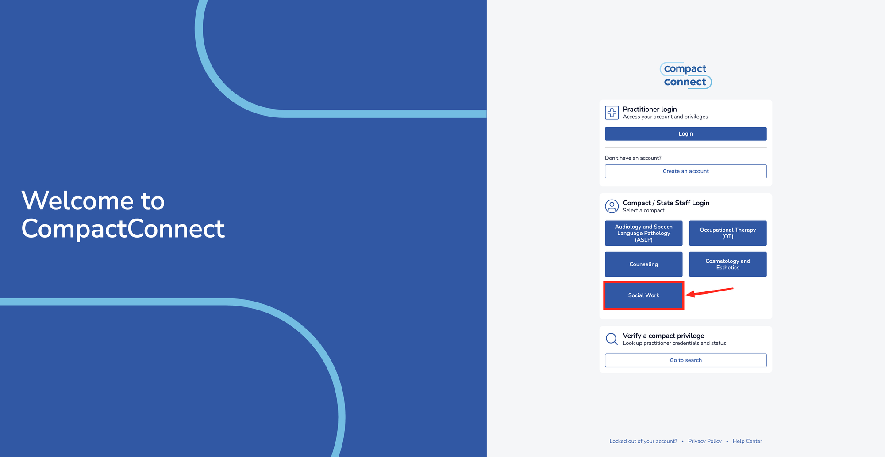

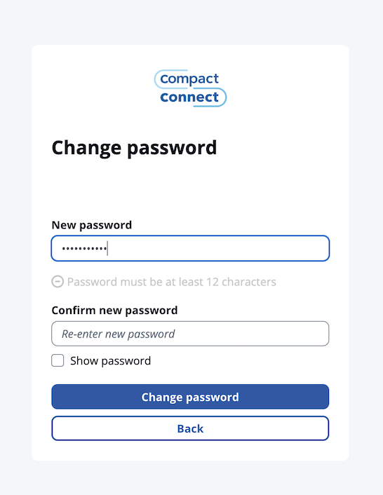

---

## User Management

Once logged in, administrators can manage staff users through the user management interface.

### Accessing User Management
Navigate to **"Manage Users"** in the left navigation panel to access user management functions.

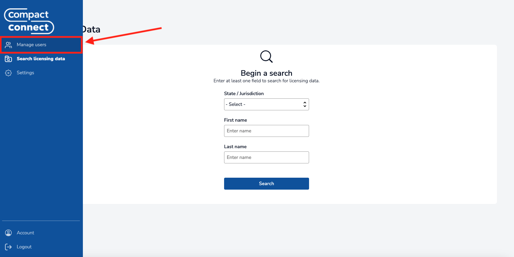

The User Management Page lists users with access to the system, along with their permissions, affiliation, and jurisdiction access.

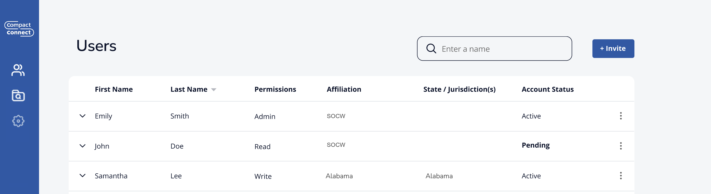

### Inviting New Staff Users

#### Steps to Invite Users
1. Click the **"Invite"** button in the top-right corner of the User Management page
2. Complete the invitation form with the following information:
   - User's email address
   - First and last name
   - Compact or State affiliation
   - Required permissions (see [Permissions](#permissions) section below)
3. Click **"Send Invite"** to dispatch the email invitation

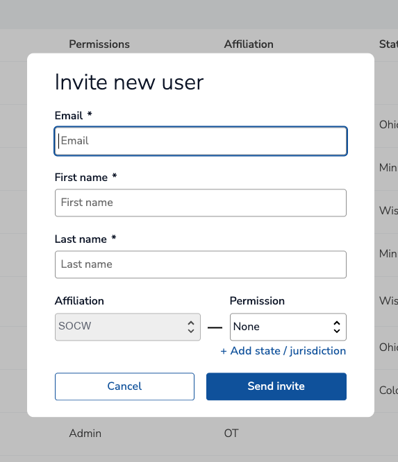

### Permissions

The Social Work Compact system uses role-based permissions that can be granted at either the compact or state level:

#### Available Permissions

##### Read Private
- Access to non-public practitioner information (e.g., date of birth)
- Should only be granted when necessary for job responsibilities
- Does NOT grant access to full SSNs. That is granted by the `Read SSN` permission.

##### Read SSN
- Access to full Social Security Numbers of practitioners
- Does NOT grant access to any other non-public information (e.g., date of birth). That is granted by the `Read Private` permission.
> ⚠️ **Critical**: Grant this permission only when necessary for job responsibilities

##### Admin
- Manage other users within their respective Compact or State scope
- Configure system notification recipients
- Configure live status for the compact or jurisdiction
- **State Admins**: Can set encumbrances on licenses and privileges
- Includes both Read Private and Read SSN permissions

##### Write (State-level only)
- Upload licensure data for a specific state

### Managing Existing Users

#### Resending Invitations
If a user hasn't logged in within seven days or didn't receive their initial invitation:

1. Locate the user in the User Management list
2. Click the three-dot menu (⋮) next to their name
3. Select **"Resend Invite"**

#### Editing User Permissions
To modify a user's permissions:

1. Click the three-dot menu (⋮) next to the user's name
2. Select **"Edit Permissions"**
3. Adjust the permission settings as needed
4. Click **"Save Changes"**

>⚠️ **Important**: Users currently logged into the system must log out and log back in for permission changes to take effect.

#### Deactivating Users
When a staff member leaves their position:

1. Click the three-dot menu (⋮) next to their name
2. Select **"Deactivate"**
3. Confirm the deactivation

---

## System Configuration

### Accessing Settings
Administrators can configure system settings by clicking the **gear icon** on the left navigation panel. The available settings will depend on your role and permissions.

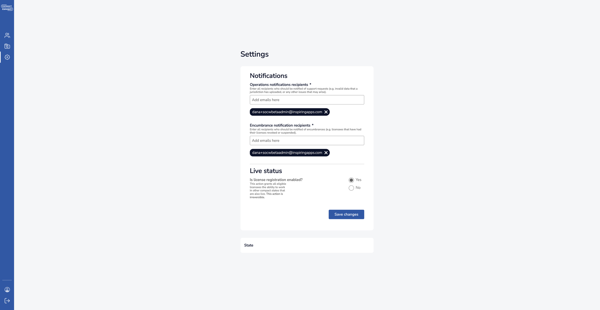

---

### State/Jurisdiction Administrator Settings

State administrators have access to jurisdiction-specific configuration options that control how their state operates within the Social Work Compact system.

#### Contact Details for System Notifications

State administrators must provide email addresses for two types of system notifications:

**1. Operations Notification Recipients**
- Email addresses added to this list will receive notifications related to technical support (such as issues with license uploads)

**2. Encumbrance Notification Recipients**
- Email addresses added to this list will receive notifications whenever a license or privilege is encumbered in the system
- These notifications are sent to **all states** where the affected practitioner holds a license or privilege, not just the state that initiated the encumbrance
- Notifications are sent soon after a state administrator submits an encumbrance event in the system

> **💡 Recommendation**: Use distribution lists that users can subscribe to or unsubscribe from without requiring configuration changes in the system.

#### Live Status

By default, a jurisdiction is not live in the compact. A state administrator must explicitly mark their jurisdiction as live when ready.

When a state is marked live:
- Eligible licensees in your state are granted the ability to work in other compact states that are also live
- Licensees from other live compact states are automatically granted the ability to work in your state

> ⚠️ **Important**: Once enabled, this setting cannot be disabled

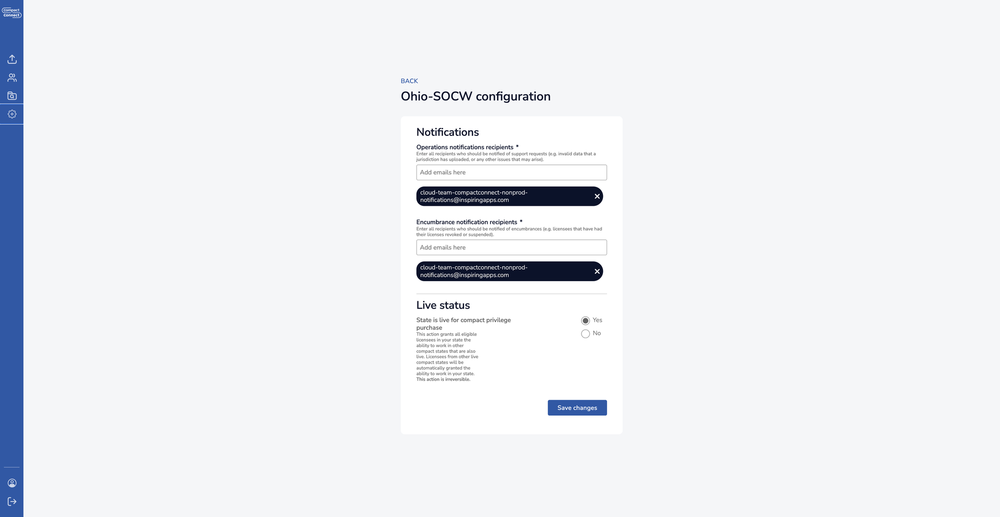

---

### Compact Administrator Settings

Compact administrators have access to compact-wide configuration options that affect all participating jurisdictions.

#### Contact Details for System Notifications

Similar to state administrators, compact administrators must configure notification contacts:

**1. Operations Notification Recipients**
- Email addresses added to this list will receive notifications related to technical support at the compact level.

**2. Encumbrance Notification Recipients**
- Email addresses added to this list will receive notifications whenever a license or privilege is encumbered in the system
- These notifications are sent for all encumbrance events across all participating states within the compact
- Notifications are sent soon after a state administrator submits an encumbrance event in the system

#### Live Status

Compact administrators can enable live status at the compact level. This is the first step toward allowing states to go live. State admins must then also mark their individual jurisdictions as live:

> ⚠️ **Important**: Once enabled, this setting cannot be disabled

### Settings Validation and Confirmation

After making any configuration changes:

1. Review all entered information for accuracy
2. Click **"Save Changes"** or **"Submit"** as appropriate
3. Look for confirmation messages indicating successful updates
4. Some changes may require system processing time before taking effect

⚠️ **Important Notes:**
- It is recommended to test any configuration changes in the Beta environment before making changes in the Production environment.

## General User Functions

### Searching License Data

#### Accessing the Search Function
Select **"Search Licensing Data"** from the left navigation panel.

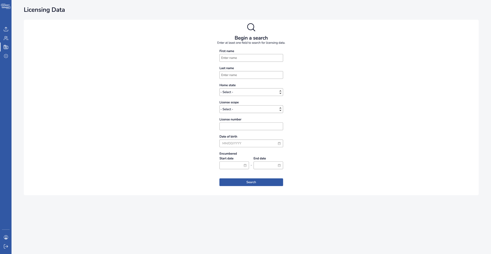

#### Search Criteria
You can search using the following parameters:
- **First name** / **Last name**: Practitioner name
- **Home state**: Filter by the practitioner's home state
- **License scope**: Filter by single-state or multi-state licenses
- **License number**: Filter by license number
- **Date of birth**: Filter by date of birth
- **Encumbered** date range: Filter by encumbrance start and/or end dates

You can use any combination of these fields. At least one field must be entered to run a search.

⚠️ **Note**: Partial name searches are not currently supported. You must enter the complete first and last name.

#### Performing a Search
1. Enter your search criteria
2. Click **"Search"**
3. Review results on the License Listing page
4. Click any row to view detailed practitioner information

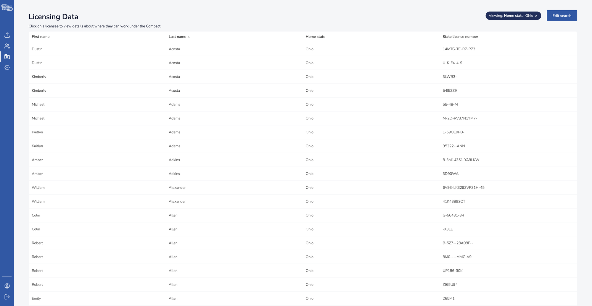

### Practitioner Details Page

The practitioner details page displays comprehensive license and privilege information for individual practitioners.

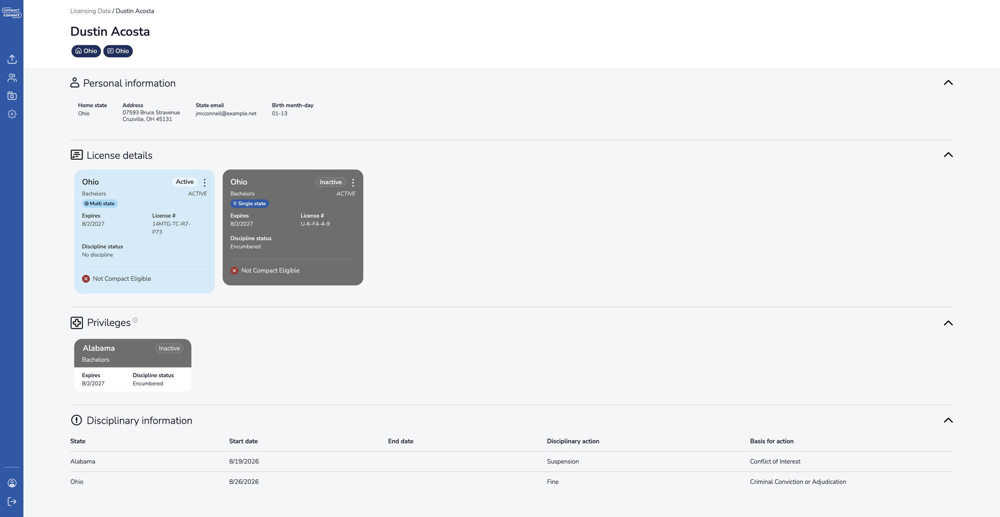

#### Available Information:
- Licenses and their current status
- Privileges and their current status

---

## Data Upload

### License Information Upload
**This feature is only available to staff users with write permissions.**

#### Uploading License Data
1. Select **"Upload Data"** from the left navigation panel

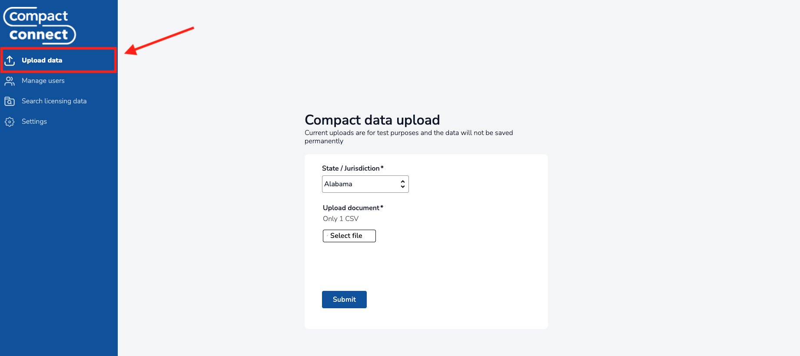

2. Click **"Select File"** to select your CSV document
3. Ensure your license data in the CSV file includes all required license data fields as specified in the [License Data Schema Documentation](../../README.md).
4. Click **"Submit"** to process the upload

#### Upload Validation
When uploading CSV documents, the system must process every license record included in the file. This process can take a while depending on the size of the file. Rather than requiring users to wait for this process to complete, the system will validate your data internally in the system and provide weekly email feedback on the following:
- Successful imports
- Data formatting errors
- Missing required fields

These email notifications will be sent to whichever email addresses have been set by the state admin for your respective state's Operations notification recipients.

⚠️ **Note**: States that would prefer immediate feedback on their license data uploads have the option to set up automated license data uploading through the Social Work Compact API, as described below.

---

## Automated License Data Upload for IT Departments

### Overview
State IT departments can set up automated license data uploads to CompactConnect through the API, eliminating the need for manual CSV uploads and ensuring timely data synchronization between state licensing systems and CompactConnect. For more information about this setup, see the following document:

**[Automated License Data Upload Onboarding Instructions](../it_staff_onboarding_instructions.md)**

---

## Privilege and License Management

### Encumbering Privileges and Licenses
**This feature is only available to State Administrators (i.e., users with 'admin' role on a particular jurisdiction).**

#### Steps to Add an Encumbrance
1. Navigate to the practitioner's detail page (see [Practitioner Details](#practitioner-details-page))
2. Locate the privilege or license requiring encumbrance
3. Click the three-dot menu (⋮) in the top-right corner of the card

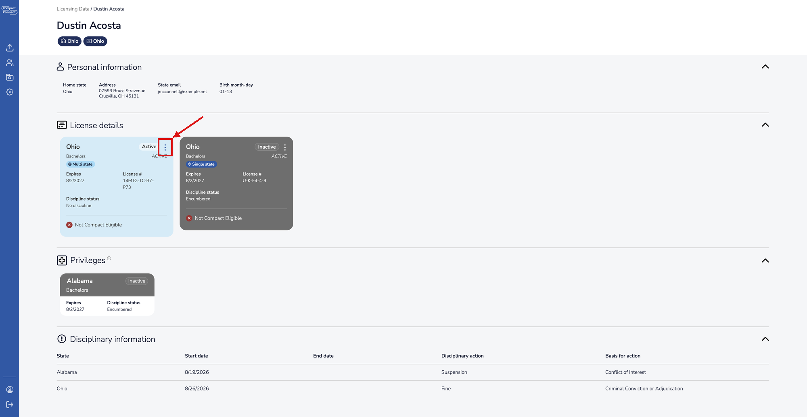

4. Select **"Encumber"**
5. Complete the encumbrance form with required information
6. If you are encumbering a privilege, there will be a button labeled **"Yes, encumber privilege"**. If you are encumbering a license, there will be a button labeled **"Yes, encumber license"**. Select the button to finish placing the encumbrance.

#### Removing Encumbrances
To remove an existing encumbrance:
1. Navigate to the practitioner's detail page
2. Locate the encumbered privilege or license
3. Click the three-dot menu (⋮) in the top-right corner of the card
4. Select **"Unencumber"**
5. Complete the removal form
6. Click the **"Confirm removal(s)"** button.

---
