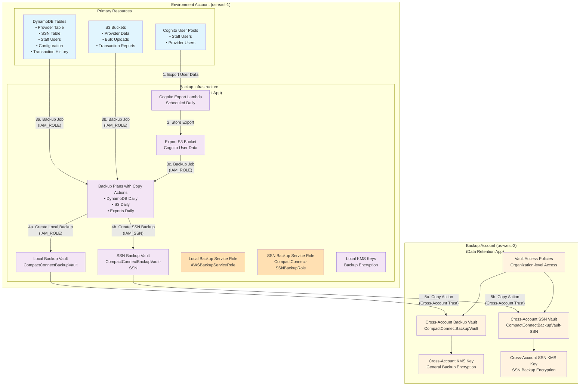

# Data retention (and backup) feature

This document includes the implementation plan for the data retention feature described here:
https://github.com/csg-org/CompactConnect/issues/246


## Architecture

AWS Backup will provide the core of our data retention and backup plan. Each Compact-Connect environment account will include a Backup Vault in-account, as the backup target for key resources. Resources we back up into the vault are discussed below. These in-account vaults have their data replicated into a separate account, in a separate region, to provide both physical and logical isolation. This cross-account backup architecture will roughly follow the implementation described by [this AWS blog](https://aws.amazon.com/blogs/storage/secure-data-recovery-with-cross-account-backup-and-cross-region-copy-using-aws-backup/). Note that the CloudFormation templates referenced in the blog are downloaded separately and available [here](./CABIAMStackSet.yaml) and [here](./CABVaultStackSets.yaml).

The scope of this feature is for data retention/backup only. Recovery of this data is reserved for a [separate follow-on ticket](https://github.com/csg-org/CompactConnect/issues/235). However, since this data retention does need to support disaster recovery, we need to the recovery strategy when determining where and how to store our backups.

While the details are yet to be determined, the notional disaster recovery plan is based on a hot/cold architecture. We will expand our current, single-region hot-only deployment to a hot/cold, multi-region, multi-account deployment, where we will still only have a single hot, regional, deployment, but with a mostly-deployed 'cold' regional deployment in a secondary account, in a secondary region. In the event of an account compromise or regional outage, we plan to use the third-region vault to restore data into the 'cold' deployment resources to facilitate disaster recovery into the 'cold' deployment within 1 to 3 days. Hydration of 'cold' databases and s3 buckets may require some custom automation to transfer restored data from new resources created by the Backup restore process into the pre-existing resources. Recovery of Cognito users will likely be less smooth, because full export/restore of Cognito user pool data is not possible. Details for each resource type are discussed below.

The implementation of this feature will require additions to the compact-connect CDK content as well as elements controlled by our multi-account architecture.



### DynamoDB Tables

DynamoDB tables including provider data, staff user data, compact and jurisdiction configuration, data event history, and payment processor transaction history require backup. DynamoDB provides out-of-the-box integration with AWS Backup, so we will simply define a backup policy to store backups in the Vault. Note that the SSN table will need special handling, since it contains our most sensitive data - Social Security Numbers. The table already has tight access controls around it and any replication of that data will need similarly strict access controls. See the [Design README](../compact-connect/docs/design/README.md) *SSN Access Controls* section for discussion of the current protections in place.

### S3 Buckets

Compact-Connect includes an s3 bucket for storing of provider data, such as military affiliation documents. S3 supports out-of-the box integration with AWS Backup, so the provider data bucket will simply define a backup policy to store backups in the Vault.

### Cognito User Pools

Compact-Connect includes two User Pools: One for staff users, one for provider users. Cognito _does not_ provide out-of-the-box integration with AWS Backup. We will need to build a custom lambda-based user data export-and-store process to export Cognito user data for each user pool into s3 objects, then back those up into AWS Backup. The data restore process for this custom-export will be out of scope for this ticket; it will be implemented as part of the [Disaster Recovery ticket](https://github.com/csg-org/CompactConnect/issues/235).

The data export process will need to extract all user attributes though, notably, password data is not exportable from Cognito, so the recovery plan will need to include a process to to:
- 'Migrate' a user to a new user pool by creating an identical user with the same attributes
- Put the 'migrated' users into a state where they can self-serve a password reset.

While that recovery process is out of scope of this ticket, we will need to at least make a point to store enough information in the backup that such a recovery is possible.

### Others?

We will need to review the app architecture for any other persisted data that may need backup and restore.


## Implementation Plan

We will implement in small, digestible phases, each of which will include testing and validation:

### Phase 1: Cross-Account Backup Destination Infrastructure

**Objective**: Establish the backup account infrastructure to receive cross-account backup copies.

Phase 1 creates the backup account infrastructure that serves as the secure, isolated destination for backup copies from all environment accounts. This phase implements a simplified version of the cross-account backup architecture described in the AWS blog "How to secure recovery with cross-account backup and cross-Region copy using AWS Backup," focusing only on the backup account components.

The backup account is deployed in `us-west-2` (separate from the primary `us-east-1` region) to provide geographic separation for disaster recovery scenarios. This account contains only the destination backup vaults and KMS keys needed to receive and store backup copies from environment accounts. All backup creation and management happens within the environment accounts themselves via the CompactConnect application.

The design uses customer-managed KMS keys for encryption, ensuring that backup data remains encrypted at rest with keys that are independent of the source accounts. Vault access policies are configured to accept backup copies only from specific organization accounts, preventing unauthorized access while enabling the automated copy actions from environment accounts.

This simplified approach eliminates the complexity of StackSets and cross-stack references while maintaining the security and isolation benefits of cross-account backup storage. Environment accounts will create their own backup infrastructure (vaults, roles, plans) as part of their CompactConnect deployment, then use copy actions to replicate backups to this centralized backup account.

**Details**:
- **Codebase Location**:
  - New CDK app: `backend/multi-account/data-retention/`
  - Single stack: `BackupAccountStack` (simplified, no StackSets)
  - Documentation updates: `backend/multi-account/README.md`, `backend/compact-connect/README.md`
- **Resource Management**:
  - Deploy only to backup account (no management account deployment needed)
  - Create cross-account backup vaults and KMS keys
  - Configure organization-level access policies
- **Automated Testing**:
  - Unit tests for backup vault creation and cross-account policies
  - Smoke tests for backup vault accessibility from organization accounts
- **Manual Steps**:
  - Create backup account through AWS Organizations
  - Update CDK context files with backup account ID and target region
  - Deploy BackupAccountStack to backup account
  - Verify cross-account access policies
- **Requirements**:
  - Cross-account backup vault in `us-west-2` region (`CompactConnectBackupVault`)
  - **Dedicated SSN backup vault** (`CompactConnectBackupVault-SSN`) with enhanced access controls
  - Customer-managed KMS key for general backup encryption
  - **Separate KMS key for SSN backup encryption** with restricted cross-account access
  - Organization-level vault access policies allowing copy operations from environment accounts
  - **Break-glass security policies** on SSN vault and KMS key requiring explicit policy modification for emergency access
  - Updated setup documentation for backup account provisioning

### Phase 2: Environment Account Backup Infrastructure & DynamoDB Implementation

**Objective**: Implement comprehensive backup infrastructure within environment accounts and DynamoDB table backup integration.

Phase 2 establishes the complete backup infrastructure within each environment account as part of the CompactConnect application deployment. This phase creates local backup vaults, IAM roles, and KMS keys within each environment account, then implements DynamoDB table backup using a distributed architecture where each table resource manages its own backup policy.

The design centers around a backup infrastructure stack that creates shared resources (local backup vaults, IAM roles, KMS keys) and a common backup construct that individual resources use to create their backup plans. Each DynamoDB table will specify a backup category (such as `critical_data` for provider and SSN tables, or `configuration_data` for compact configuration tables) that maps to predefined backup policies including schedule, retention periods, and cross-account replication rules.

To meet our 1-day Recovery Point Objective (RPO), all DynamoDB tables will be backed up daily, regardless of category. The category system primarily differentiates retention periods and storage lifecycle policies rather than backup frequency. Critical data like provider information and SSN records will have longer retention periods (7 years) while configuration data may have shorter retention (3 years), but both will be backed up daily.

Each environment account manages its own complete backup infrastructure, eliminating cross-stack references and StackSet complexity. Backup plans include copy actions that automatically replicate backups to the cross-account destination vaults created in Phase 1, ensuring both local availability and cross-account disaster recovery capability.

**Details**:
- **Codebase Location**:
  - New backup infrastructure stack: `backend/compact-connect/stacks/backup_infrastructure_stack.py` (creates local vaults, IAM roles, KMS keys)
  - New common construct: `backend/compact-connect/common_constructs/backup_plan.py`
  - Updates to individual resource files: `backend/compact-connect/stacks/persistent_stack/provider_table.py`, `ssn_table.py`, `transaction_history_table.py`, etc.
  - **Enhanced SSN table backup**: `backend/compact-connect/stacks/persistent_stack/ssn_table.py` (implements `ssn_data` backup category with dedicated local vault)
  - Stack integration: `backend/compact-connect/stacks/persistent_stack/__init__.py`
  - App integration: `backend/compact-connect/app.py` (add backup infrastructure stack to BackendStage)
  - CDK context configuration: backup policies in `cdk.json` and environment-specific context files (includes `ssn_data` category)
- **Resource Management**:
  - Backup infrastructure stack creates all environment account backup resources:
    - Local backup vaults (`CompactConnectBackupVault`, `CompactConnectBackupVault-SSN`)
    - IAM service roles (`AWSBackupServiceRole`, `CompactConnect-SSNBackupRole`)
    - Local KMS keys for backup encryption
    - Cross-account destination vault ARN references from CDK context
  - Deploy as part of existing BackendStage in CompactConnect app
  - Each DynamoDB table resource file manages its own backup plan using common constructs
  - **SSN table uses dedicated local backup vault** and specialized backup role
  - Common backup construct reads schedule and retention policies from CDK context
  - Resources specify their backup category (`critical_data`, `configuration_data`, `ssn_data`, etc.)
  - **SSN table backup plan includes additional security validations** and enhanced audit logging
  - Copy actions in backup plans reference cross-account destination vaults by ARN
- **Automated Testing**:
  - Unit tests for backup plan configurations
  - Integration tests for backup job execution
  - **Comprehensive SSN table backup security tests**:
    - Verify SSN backups use dedicated vault and KMS key
    - Test specialized backup role permissions and batch operation denial
    - Validate enhanced CloudTrail logging for SSN backup operations
    - Test break-glass access controls for emergency restoration
  - Backup and point-in-time recovery validation tests
- **Manual Steps**:
  - Configure backup schedules (daily for critical tables, weekly for configuration)
  - Set retention policies (30 days warm, 90 days cold, 7 years archive)
  - **Establish SSN backup operational procedures**:
    - Configure quarterly access reviews for SSN backup infrastructure
    - Test SSN backup monitoring and alerting with dedicated thresholds
  - Test backup job execution in sandbox environment
- **Requirements**:
  - **Complete environment account backup infrastructure**:
    - Local backup vaults (`CompactConnectBackupVault`, `CompactConnectBackupVault-SSN`)
    - IAM service roles (`AWSBackupServiceRole`, `CompactConnect-SSNBackupRole`)
    - Local KMS keys for backup encryption
    - Cross-account destination vault ARN configuration from CDK context
  - Daily backups for all DynamoDB tables to meet 1-day RPO requirement
  - Cross-account replication via copy actions to backup account destination vaults
  - Category-based retention policies (`critical_data` 7 years, `configuration_data` 3 years, `ssn_data` 7 years)
  - **Enhanced SSN Table Security**:
    - Dedicated local backup vault exclusively for SSN data (`CompactConnectBackupVault-SSN`)
    - Separate local KMS key for SSN backup encryption
    - Specialized backup service role (`CompactConnect-SSNBackupRole`) with minimal permissions and explicit batch operation denial
    - Enhanced CloudTrail logging for all SSN backup operations (create, delete, describe, restore)
    - **Break-glass access controls**: DENY policies on both local SSN backup vault and KMS key that block all restore/decrypt operations except for AWS services, requiring explicit policy modification for emergency restoration
    - Copy actions replicate SSN backups to dedicated cross-account SSN vault (which also has break-glass DENY policies)
    - Quarterly access reviews for SSN backup infrastructure
    - SSN backup category (`ssn_data`) with 7-year retention and separate cross-account vault destination
    - **Documentation of SSN backup procedures**: Break-glass access procedures (policy modification steps for emergency restoration), emergency restoration workflows, and operational runbooks for SSN backup infrastructure
    - **Note**: Operational documentation must include specific example temporary policy statements to use during disaster recovery exercises, with exact JSON policy snippets for modifying both local and cross-account SSN backup vault and KMS key policies
  - Common backup construct for consistent policies across resources
  - Context-driven backup policies (schedules, retention, cross-account rules)
  - **Context configuration includes cross-account destination ARNs**:
    ```json
    {
      "backup_account_id": "123456789012",
      "backup_region": "us-west-2",
      "backup_policies": {
        "ssn_data": {
          "schedule": "cron(0 2 * * ? *)",
          "retention_days": 2555,
          "lifecycle": {
            "cold_storage_days": 30,
            "delete_after_days": 2555
          },
          "cross_account_vault_arn": "arn:aws:backup:us-west-2:123456789012:backup-vault:CompactConnectBackupVault-SSN",
          "dedicated_vault": true,
          "enhanced_monitoring": true,
          "specialized_role": "CompactConnect-SSNBackupRole"
        }
      }
    }
    ```
  - Each resource manages its own backup plan using shared local infrastructure and common patterns
  - Environment-specific backup policy overrides capability
  - Backup completion monitoring and alerting

### Phase 3: S3 Bucket Backup Implementation

**Objective**: Implement S3 bucket backup for provider data and document storage.

Phase 3 extends the distributed backup architecture established in Phase 2 to S3 resources that contain primary data requiring backup protection. This phase focuses specifically on buckets containing provider documents and other irreplaceable data, such as `provider_users_bucket.py`, while excluding buckets that store transitory data or derived reports like `bulk_uploads_bucket.py` and `transaction_reports_bucket.py`. Each qualifying S3 bucket construct will implement its own backup plan using the same common backup construct developed in Phase 2.

The design leverages the backup category system, with primary data S3 buckets falling into the `document_storage` category. This category defines backup policies optimized for larger, less frequently changing data typical of document storage systems. However, to maintain our 1-day RPO commitment, qualifying S3 buckets will also be backed up daily, with the category primarily influencing retention policies and storage lifecycle management rather than backup frequency.

The implementation includes clear criteria for determining which S3 buckets require backup protection. Buckets containing primary provider data, uploaded documents, or other irreplaceable information are included in the backup strategy. Buckets used for temporary storage during bulk upload processing or those containing derived reports that can be regenerated from primary data sources are explicitly excluded from backup operations, reducing storage costs and backup complexity.

S3 backup integration with AWS Backup provides native support for backing up S3 data, including versioned objects and metadata. The backup plans will include cross-account copy actions that replicate S3 backup data to the backup account vault, following the same pattern established for DynamoDB resources. This ensures that document storage has the same level of cross-account protection as database resources.

The implementation takes advantage of S3's existing encryption and access policies, ensuring that backup operations respect the same security controls as the original data. For buckets containing sensitive provider data, the backup process will maintain the same encryption standards established by the original bucket policies.

**Details**:
- **Codebase Location**:
  - Updates to primary data bucket constructs: `backend/compact-connect/stacks/persistent_stack/provider_users_bucket.py` (and other buckets containing irreplaceable data)
  - Exclude transitory data buckets: `bulk_uploads_bucket.py`, `transaction_reports_bucket.py` (no backup implementation)
  - Utilize common backup construct from Phase 2
- **Resource Management**:
  - Utilize local backup infrastructure created in Phase 2 (local vaults, IAM roles, KMS keys)
  - Only primary data S3 bucket resource files implement backup plans using common backup construct
  - Qualifying S3 buckets specify backup category (`document_storage` for primary data buckets)
  - Cross-account replication configured at the resource level through copy actions to backup account vaults
  - Backup schedules and retention read from CDK context configuration
  - Clear documentation of backup inclusion/exclusion criteria for bucket types
- **Automated Testing**:
  - Unit tests for S3 backup plan configurations
  - Integration tests for backup job execution with sample data
  - Restore tests for different object types and sizes
  - Performance tests for large file backup scenarios
- **Manual Steps**:
  - Configure backup schedules (weekly full, daily incremental)
  - Set retention policies aligned with DynamoDB backup strategy
  - Test backup and restore workflows
  - Validate backup encryption and access controls
- **Requirements**:
  - Daily backups for primary data S3 buckets to meet 1-day RPO requirement
  - Exclusion of transitory/derived data buckets from backup operations
  - Cross-account replication of backup data via copy actions to backup account vault
  - Backup versioning and lifecycle management using context-configured retention policies
  - Integration with existing bucket encryption and access policies
  - Consistent backup patterns with DynamoDB resources from Phase 2
  - Clear criteria documentation for determining which buckets require backup protection

### Phase 3.5: Investigate Event Bridge backup

### Phase 4: Cognito User Pool Custom Backup

**Objective**: Implement custom Lambda-based export system for Cognito user pool data.

Phase 4 addresses the unique challenge of backing up Cognito user pool data, which does not have native AWS Backup integration. This phase implements a custom backup solution using a Lambda function that exports user data to S3, which is then backed up using the same distributed backup architecture established in previous phases.

The solution involves a scheduled Lambda function that runs daily to extract all user attributes from both the staff and provider user pools. The Lambda function will use the Cognito APIs to enumerate users and export their attributes, group memberships, and other metadata to structured files (likely JSON format) stored in a dedicated S3 bucket. While Cognito does not allow export of password hashes for security reasons, the export will capture all recoverable user attributes necessary for disaster recovery scenarios.

The exported data will be stored in a new S3 bucket construct (`cognito_backup_bucket.py`) that follows the same patterns as other S3 resources. This bucket will use the `export_data` backup category, which is configured for daily backups with appropriate retention policies for exported data. The bucket will implement the same backup plan architecture using the common backup construct, ensuring cross-account replication and consistent lifecycle management.

The scheduling mechanism leverages EventBridge rules deployed as part of the backup infrastructure stack, providing centralized management of backup-related scheduling while keeping the export logic modular within the Lambda function. This approach ensures the Cognito backup process integrates seamlessly with the overall backup monitoring and alerting established in later phases.

The design specifically accounts for the future disaster recovery implementation by ensuring the export format contains sufficient information to reconstruct user accounts in a new Cognito user pool, including all necessary attributes for user migration scenarios.

**Details**:
- **Codebase Location**:
  - New Lambda: `backend/compact-connect/lambdas/python/cognito_backup/`
  - Lambda function: `lambda_function.py`, requirements: `requirements.txt`
  - New S3 bucket construct: `backend/compact-connect/stacks/persistent_stack/cognito_backup_bucket.py`
  - EventBridge rule for scheduling: added to backup infrastructure stack
- **Resource Management**:
  - Deploy as part of CompactConnect CDK app backend stage
  - Integrate with local backup infrastructure from Phase 2 (local vaults, IAM roles)
  - Cognito export bucket manages its own backup plan using common backup construct
  - Lambda function scheduled via EventBridge rule in backup infrastructure stack
  - Export bucket specifies `export_data` backup category for appropriate schedule/retention
  - Copy actions replicate exported data backups to backup account vault
- **Automated Testing**:
  - Unit tests for user data export functionality
  - Integration tests with test Cognito user pools
  - Data completeness validation tests
  - Backup file format and encryption tests
  - End-to-end tests for export-to-backup pipeline
- **Manual Steps**:
  - Configure export schedules (daily at 2 AM UTC)
  - Test export functionality with sample user data
  - Validate exported data format and completeness
  - Ensure exported files are properly backed up to cross-account vault
- **Requirements**:
  - Daily export of all user attributes from both user pools via scheduled Lambda
  - Secure storage of exported data in S3 with encryption at rest and in transit
  - Integration with local AWS Backup infrastructure for cross-account replication using `export_data` backup category
  - Export format suitable for future disaster recovery implementation
  - PII data handling compliance (encryption at rest and in transit)
  - Consistent backup management using common constructs and context-driven policies

### Phase 5: Monitoring, Alerting, and Integration Testing

**Objective**: Implement comprehensive monitoring and complete end-to-end testing of the backup system.

Phase 5 establishes comprehensive monitoring and alerting for the distributed backup architecture, ensuring operational visibility and proactive failure detection across all backup operations. This phase creates a unified monitoring approach that aggregates backup health across the distributed resource-level backup plans established in previous phases.

The monitoring design leverages CloudWatch metrics from AWS Backup, creating custom dashboards that provide visibility into backup job success rates, duration, and storage utilization across all resource categories. Custom CloudWatch alarms will detect backup job failures, extended backup durations, and cross-account replication issues, integrating with the existing notification infrastructure to ensure operational teams receive timely alerts.

The alerting system will differentiate between different types of backup failures - for example, a single resource backup failure might generate a standard alert, while multiple concurrent failures could indicate a systemic issue requiring elevated response. The monitoring will also track backup storage costs and retention compliance, providing visibility into the financial and compliance aspects of the backup system.

Integration testing in this phase validates the entire backup ecosystem, including cross-account replication, disaster recovery scenarios, and backup restoration procedures. The testing includes automated validation of backup completeness, cross-account accessibility, and recovery point objective compliance. End-to-end tests will simulate various failure scenarios, including account outages, regional failures, and data corruption events, validating that the backup system can support the planned disaster recovery architecture.

**Details**:
- **Codebase Location**:
  - New monitoring stack: `backend/compact-connect/stacks/backup_monitoring_stack.py`
  - CloudWatch alarms and SNS topics for local backup operations
  - Update to notification stack: `backend/compact-connect/stacks/notification_stack.py`
- **Resource Management**:
  - Deploy as part of CompactConnect CDK app backend stage
  - Integrate with existing alarm and notification infrastructure
  - Monitor both local backup operations and cross-account copy actions
  - Add monitoring dashboards for backup health across all categories
- **Automated Testing**:
  - End-to-end backup and restore workflow tests
  - Failure scenario testing (simulated outages, corrupted backups)
  - Performance testing for backup operations
  - Cross-account access validation tests
  - Disaster recovery scenario testing
- **Manual Steps**:
  - Configure alerting thresholds and escalation procedures
  - Test notification workflows for backup failures
  - Conduct tabletop disaster recovery exercises
- **Requirements**:
  - Real-time monitoring of all backup operations
  - Automated alerting for backup failures or delays
  - Dashboard visibility into backup health and status
  - Integration with existing operational alerting systems
  - **Operational documentation**: Backup monitoring procedures, troubleshooting guides, and runbooks for backup operations team

### Phase 6: Production Deployment and Validation

**Objective**: Deploy to production environments and validate the complete backup system.

Phase 6 represents the final deployment and validation of the backup system across all production environments, ensuring that the 1-day RPO requirement is met consistently across test, beta, and production deployments. This phase focuses on operational readiness, compliance validation, and establishing the ongoing maintenance procedures necessary for long-term backup system reliability.

The deployment approach follows a staged rollout through the existing CI/CD pipeline, with backup capabilities deployed to test environments first, followed by beta, and finally production. Each environment deployment includes validation of backup policy configuration, cross-account connectivity, and integration with environment-specific resources. The phase includes thorough testing of backup operations under production load conditions to ensure that backup processes do not impact application performance or availability.

Production validation includes comprehensive testing of backup restoration procedures, verification of backup encryption and access controls, and confirmation that all backup policies align with compliance requirements. The validation process includes both automated testing and manual verification procedures, ensuring that backup operations are functioning correctly and that restoration procedures are well-documented and tested.

This phase establishes the operational procedures for ongoing backup management, including regular backup validation, restoration testing schedules, and maintenance procedures for backup infrastructure. The phase includes training for operations teams on backup monitoring, troubleshooting procedures, and escalation processes for backup-related incidents.

**Details**:
- **Codebase Location**:
  - Production configuration updates in CDK context files
  - Environment-specific backup policies and schedules
  - Design documentation updates: `backend/compact-connect/docs/design/README.md` (new backup section)
- **Resource Management**:
  - Deploy through existing CI/CD pipeline
  - Stage rollout across test, beta, and production environments
  - Update deployment documentation
- **Automated Testing**:
  - Production smoke tests for backup functionality
  - Automated backup verification jobs
  - Regular restore testing automation
- **Manual Steps**:
  - Production deployment coordination with operations team
  - Final validation of all backup workflows
  - Establish operational monitoring and maintenance procedures
- **Requirements**:
  - All production environments have active backup protection
  - Backup operations do not impact production performance
  - Regular backup validation and testing procedures established
  - Operations team trained on backup monitoring and troubleshooting
  - Compliance with data retention and recovery requirements met
  - **Documentation deliverables**:
    - Technical design documentation updated to reflect final backup architecture implementation
    - Design documentation includes backup categories, retention policies, cross-account architecture, and disaster recovery integration points
    - Operational training materials and procedures for backup system management
    - Updated deployment and maintenance documentation
