# Compact Connect: Staff Onboarding Guide

This guide provides step-by-step instructions for Compact and State administrative staff to onboard into the Compact Connect Production and Beta environments.

## Table of Contents
- [Initial Setup and Login](#initial-setup-and-login)
- [User Management](#user-management)
- [System Configuration](#system-configuration)
- [General User Functions](#general-user-functions)
- [Data Upload](#data-upload)
- [Automated License Data Upload for IT Departments](#automated-license-data-upload-for-it-departments)
- [Privilege and License Management](#privilege-and-license-management)

---

## Initial Setup and Login

### First-Time Access
The Compact Connect team will configure the initial Compact Staff user account. You will receive an invitation email at the address provided to the team containing:
- Your username
- A temporary password
- Login instructions

### Logging In
1. Navigate to the main Compact Connect dashboard
2. Select **"Login as Compact or State Staff"**
3. Enter your login credentials using the temporary password provided
4. You will be prompted to create a permanent password upon first login

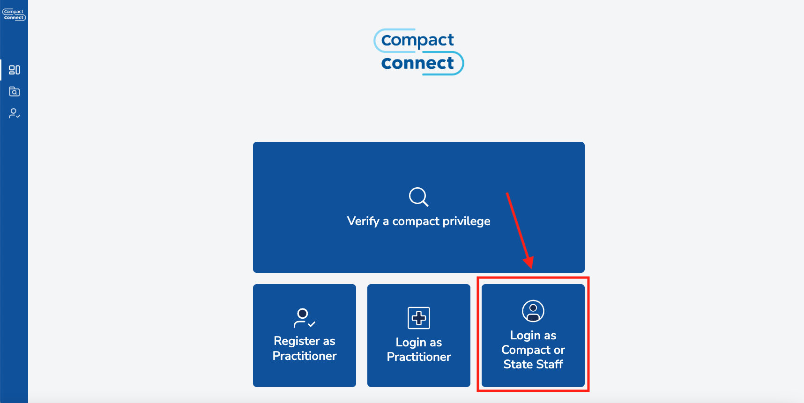

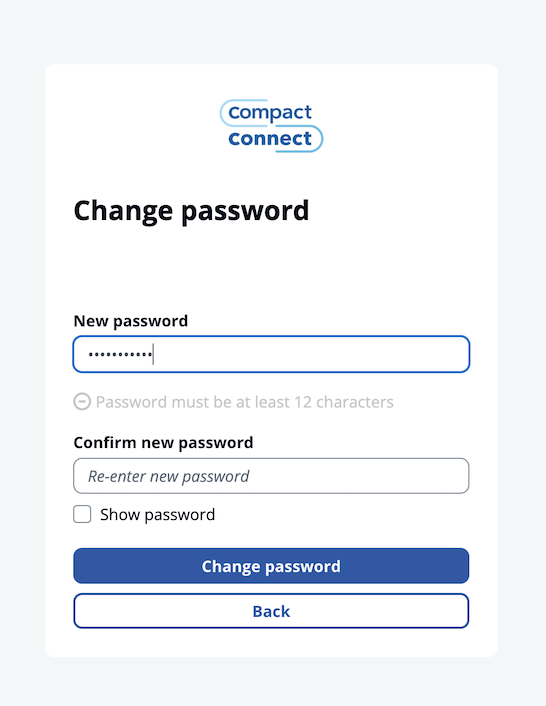

---

## User Management

Once logged in, administrators can manage staff users through the user management interface.

### Accessing User Management
Navigate to **"Manage Users"** in the left navigation panel to access user management functions.

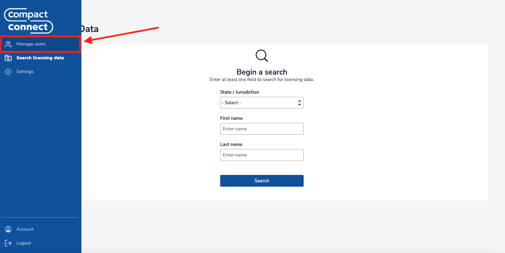

The User Management Page lists users with access to the system, along with their permissions, affiliation, and jurisdiction access.

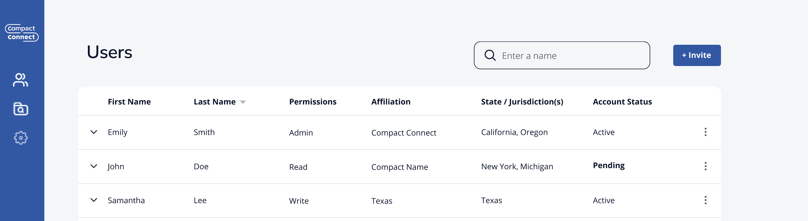

### Inviting New Staff Users

#### Steps to Invite Users
1. Click the **"Invite"** button in the top-right corner of the User Management page
2. Complete the invitation form with the following information:
   - User's email address
   - First and last name
   - Compact or State affiliation
   - Required permissions (see [Permissions](#permissions) section below)
3. Click **"Send Invite"** to dispatch the email invitation

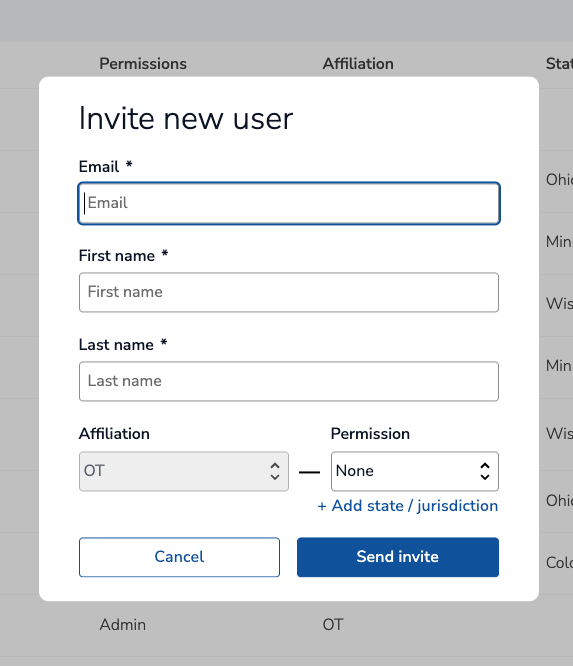

### Permissions

The Compact Connect system uses role-based permissions that can be granted at either the compact or state level:

#### Available Permissions

##### Read Private
- Access to non-public practitioner information (e.g., date of birth)
- Should only be granted when necessary for job responsibilities
- Does NOT grant access to full SSNs. That is granted by the `Read SSN` permission.

##### Read SSN
- Access to full Social Security Numbers of practitioners
- Does NOT grant access to any other non-public information (e.g., date of birth). That is granted by the `Read Private` permission.
> ⚠️ **Critical**: Grant this permission only when necessary for job responsibilities

##### Admin
- Manage other users within their respective Compact or State scope
- Define privilege fee rates
- Configure system notification recipients
- **Compact Admins**: Can deactivate privileges
- **State Admins**: Can set encumbrances on licenses and privileges
- Includes both Read Private and Read SSN permissions

##### Write (State-level only)
- Upload licensure data for a specific state

### Managing Existing Users

#### Resending Invitations
If a user hasn't logged in within seven days or didn't receive their initial invitation:

1. Locate the user in the User Management list
2. Click the three-dot menu (⋮) next to their name
3. Select **"Resend Invite"**

#### Editing User Permissions
To modify a user's permissions:

1. Click the three-dot menu (⋮) next to the user's name
2. Select **"Edit Permissions"**
3. Adjust the permission settings as needed
4. Click **"Save Changes"**

>⚠️ **Important**: Users currently logged into the system must log out and log back in for permission changes to take effect.

#### Deactivating Users
When a staff member leaves their position:

1. Click the three-dot menu (⋮) next to their name
2. Select **"Deactivate"**
3. Confirm the deactivation

---

## System Configuration

### Accessing Settings
Administrators can configure system settings by clicking the **gear icon** on the left navigation panel. The available settings will depend on your role and permissions.

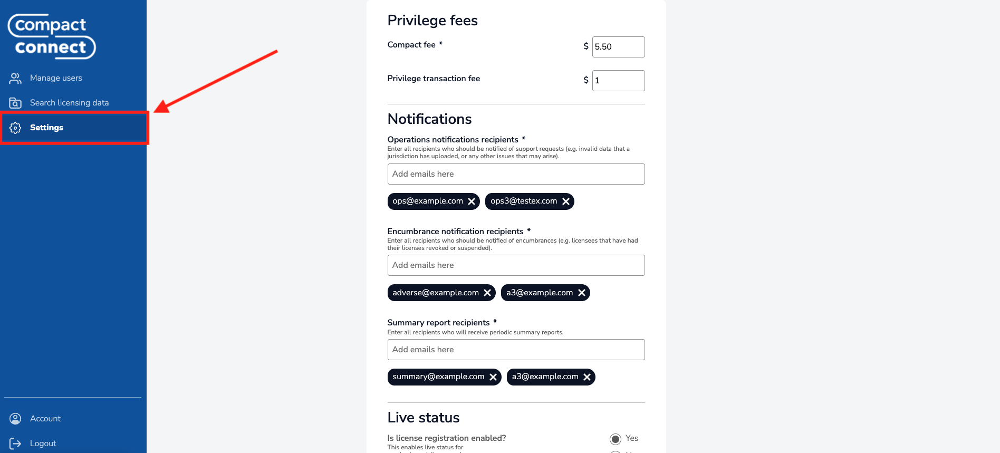

---

### State/Jurisdiction Administrator Settings

State administrators have access to jurisdiction-specific configuration options that control how their state operates within the Compact Connect system.

#### Jurisdiction Fees for Compact Privileges

State administrators must configure the fees that their jurisdiction charges for compact privileges. These fees are set per license type offered by the compact.

**Configuration Steps**
1. Navigate to the Jurisdiction Settings section
2. Locate the "Privilege Fees" section
3. Set the standard fee amount for each license type
4. Optionally configure military rates (see below)

##### Military Rate Configuration
Jurisdictions may offer reduced rates for active military-affiliated licensees:

1. Enable the "Military Rate" option
2. Set the reduced fee amount for military members
3. This creates a special fixed price for qualifying military personnel

#### Contact Details for System Notifications

State administrators must provide email addresses for three types of system notifications:

**1. Operations Notification Recipients**
- Email addresses added to this list will receive notifications related to technical support (such as issues with license uploads)

**2. Encumbrance Notification Recipients**
- Email addresses added to this list will receive notifications whenever a license or privilege is encumbered in the system
- These notifications are sent to **all states** where the affected practitioner holds a license or privilege, not just the state that initiated the encumbrance
- Notifications are sent soon after a state administrator submits an encumbrance event in the system

**3. Summary Report Notification Recipients**
- Email addresses added to this list will receive weekly and monthly financial summary reports
- These reports show the settled transaction details for transactions involving privileges purchased in your state
- Reports provide insights into privilege purchasing activity and revenue within your jurisdiction

>⚠️ **Important**: Transactions made through Authorize.net, the payment processor used by the system, take up to 24 hours to settle. Since financial reports only include settled transactions, there may be a timing discrepancy between when privileges are purchased and when they appear in financial reports. For example, privileges purchased near the end of a reporting period may not appear in that period's report if the transactions haven't settled yet, while privileges purchased during the previous period may appear if their transactions settled during the current reporting period.

> **💡 Recommendation**: Use distribution lists that users can subscribe to or unsubscribe from without requiring configuration changes in the system.

#### Jurisprudence Requirements

Configure whether your jurisdiction has jurisprudence requirements for licensees (assessment of knowledge of laws and rules governing practice):

1. Toggle the "Jurisprudence Requirements" setting
2. Optionally provide a website link where requirements are defined
3. This information helps licensees understand your jurisdiction's specific requirements

#### Enabling Licensee Registration

By default, for any particular jurisdiction, licensee registration is disabled. A state administrator must explicitly enable licensee registration for their jurisdiction when ready to do so. This allows licensees within your state to register, and allows licensees from other states to purchase privileges within your state.

> ⚠️ **Important**: Once enabled, this setting cannot be disabled

---

### Compact Administrator Settings

Compact administrators have access to compact-wide configuration options that affect all participating jurisdictions.

#### Card Code Verification (CCV) Setup in Authorize.net Account

> ⚠️ **Important**: Before configuring payment processing credentials, you must first set up the Card Code Verification (CCV) security feature in your Authorize.net account to ensure secure payment processing, described in this section. Without this setup, users will be able to submit purchases for privileges without providing a CCV as part of their credit card information.

**Setup Steps**
1. Log into your Authorize.net merchant account
2. Navigate to Account Settings by clicking the **Settings** button in the main navigation

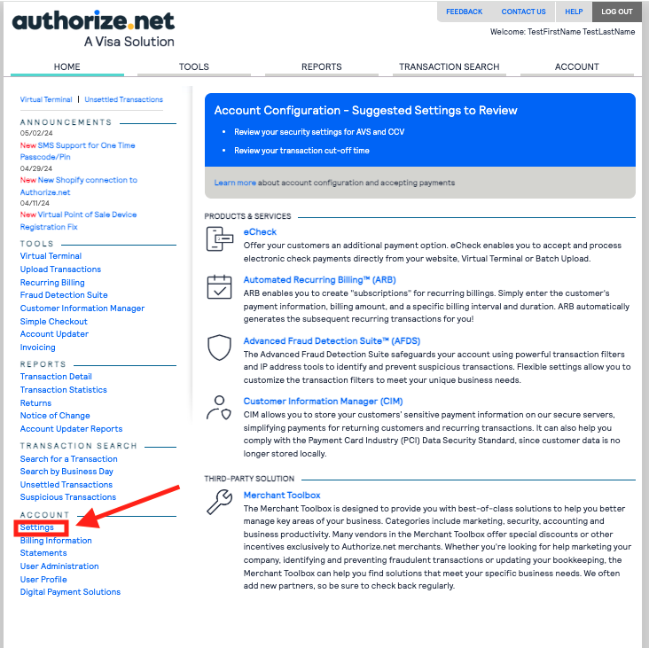

3. From the Settings page, locate and click **"Enhanced Card Code Verification"**

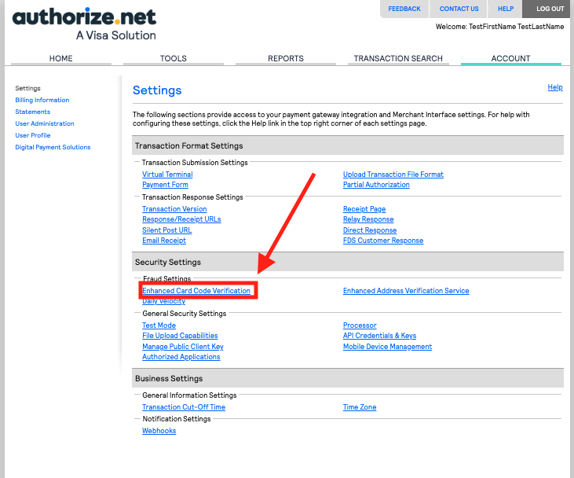

4. Configure your CCV settings to match the recommended security configuration shown below and select the save button:

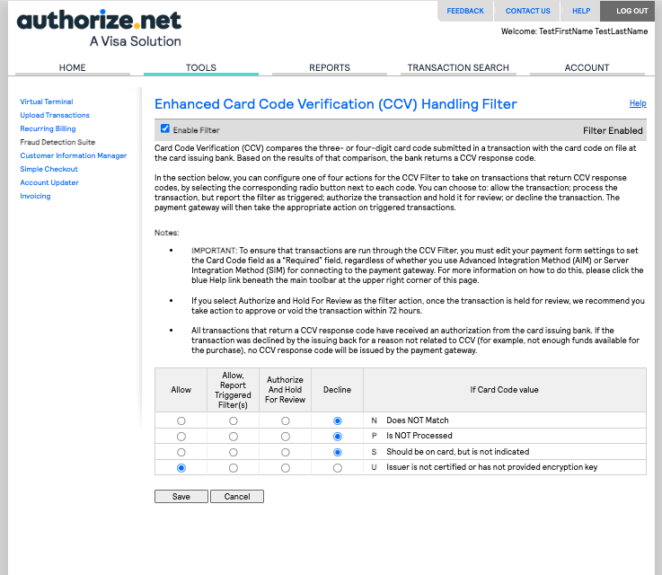

> **🔒 Security Note**: Proper CCV configuration is essential for payment security and fraud prevention. These settings help protect both your organization and licensees during payment processing.

---

> ⚠️ **Important**: After completing the CVV configuration setup in the Authorize.net account, return to the Compact Connect settings page to complete the following configuration settings.
>
#### Compact Administration Fee

The Compact Administration Fee is a standardized fee collected for every privilege purchase that supports compact operations:

**Configuration Steps**
1. Navigate to the Compact Settings section
2. Locate the "Commission Administration Fee" section
3. Set the flat rate amount (e.g., $50)
4. This fee is added to jurisdiction-specific fees for every privilege purchase

> **Important Notes:**
> - This fee is the same regardless of which jurisdiction the provider is purchasing a privilege for
> - It's applied to all privilege purchases across all participating states

#### Transaction Fee Configuration

Compact administrators can configure whether licensees are charged fees to cover payment processor costs

**Licensee Transaction Charges**
1. Enable/disable transaction fee charging
2. Set the fee amount to help cover transaction costs
3. This fee is applied once per privilege purchased

> ⚠️ **Important**: if the compact will not charge transaction fees, leave this section blank.

#### Contact Details for System Notifications

Similar to state administrators, compact administrators must configure notification contacts:

**1. Operations Notification Recipients**
- Email addresses added to this list will receive notifications related to technical support at the compact level.

**2. Encumbrance Notification Recipients**
- Email addresses added to this list will receive notifications whenever a license or privilege is encumbered in the system
- These notifications are sent for all encumbrance events across all participating states within the compact
- Notifications are sent soon after a state administrator submits an encumbrance event in the system

**3. Summary Report Notification Recipients**
- Email addresses added to this list will receive weekly and monthly financial reports
- These reports show comprehensive financial data for privilege purchases across all jurisdictions within the compact
- Reports provide detailed insights into privilege purchasing activity and revenue for the entire compact

#### Licensee Registration Settings

Compact administrators can enable licensee registration at the compact level. This is the first step to allowing licensee registration. State admins must then also select to enable licensee registration within their individual jurisdictions:

> ⚠️ **Important**: Once enabled, this setting cannot be disabled

---

#### Payment Processing Configuration

Compact administrators can configure Authorize.net payment processing credentials (this must be done after setting up the compact related fees. If you attempt to upload them before setting compact fees, the process will fail and notify you to complete setting the other configuration values for the compact):

**Setup Steps**
1. Generate API credentials in your Authorize.net account ([view documentation](https://support.authorize.net/knowledgebase/Knowledgearticle/?code=000001271))
2. Navigate to the "Authorize.net Credentials" section in Compact Settings
3. Enter your credentials:
   - **API Login ID**
   - **Transaction Key**
4. Click **"Submit"** to enable payment processing

> **🔒 Security Considerations:**
- Never share these credentials with others, and do not store them on your device.
- If credentials are ever compromised, you will need to generate new ones in your Authorize.net account. NOTE: this will invalidate your current credentials, and all purchase attempts will fail until the new credentials are uploaded into the system.
- Update the credentials in Compact Connect immediately after generating new ones

### Settings Validation and Confirmation

After making any configuration changes:

1. Review all entered information for accuracy
2. Click **"Save Changes"** or **"Submit"** as appropriate
3. Look for confirmation messages indicating successful updates
4. Some changes may require system processing time before taking effect

⚠️ **Important Notes:**
- Configuration changes may affect billing and fee collection immediately
- It is recommended to test any configuration changes in the Beta environment before making changes in the Production environment.

## General User Functions

### Searching License Data

#### Accessing the Search Function
Select **"Search Licensing Data"** from the left navigation panel.

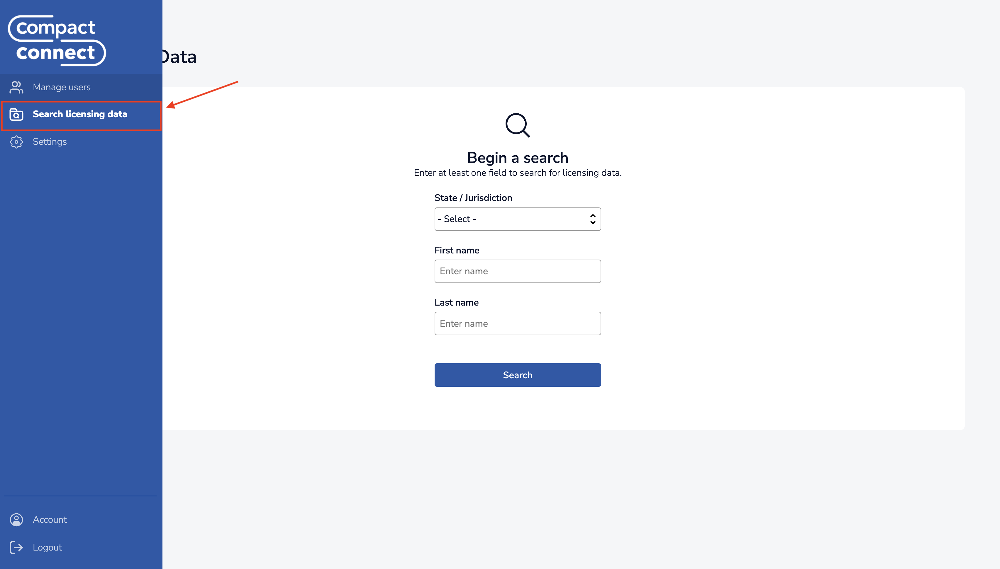

#### Search Criteria
You can search using the following parameters:
- **State/Jurisdiction**: Select from dropdown menu. This will filter the results to only display practitioners that have a license or privilege in the specified jurisdiction.
- **Practitioner Name**: Enter full first and last name
- **Combined Search**: Use both state and name criteria

⚠️ **Note**: Partial name searches are not currently supported. You must enter the complete first and last name.

#### Performing a Search
1. Enter your search criteria
2. Click **"Search"**
3. Review results on the License Listing page
4. Click any row to view detailed practitioner information

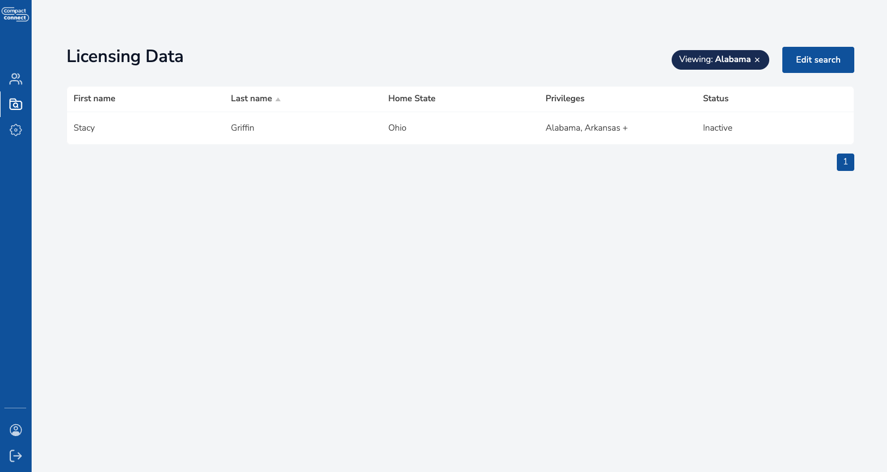

### Practitioner Details Page

The practitioner details page displays comprehensive license and privilege information for individual practitioners.

#### Available Information:
- Licenses and their current status
- Privileges and their current statis
- Privilege history and timeline

#### Viewing Privilege History
Click **"View Details"** on any privilege card to access:
- Complete privilege timeline, including status changes such as deactivation and encumbrance.
- Status change history

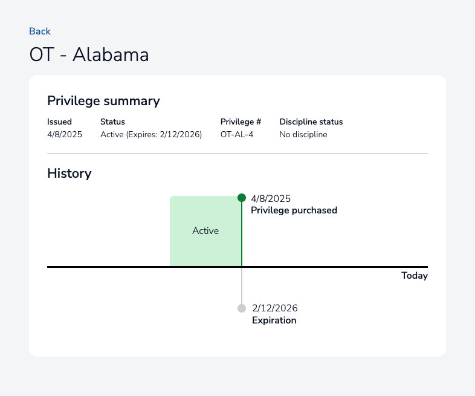

---

## Data Upload

### License Information Upload
**This feature is only available to staff users with write permissions.**

#### Uploading License Data
1. Select **"Upload Data"** from the left navigation panel
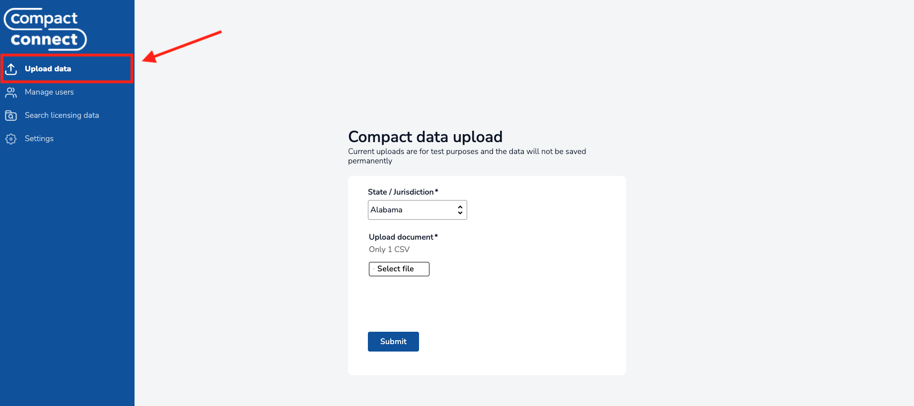
2. Click **"Select File"** to select your CSV document
3. Ensure your license data in the CSV file includes all required license data fields as specified in the [License Data Schema Documentation](../backend/compact-connect/docs/README.md).
4. Click **"Submit"** to process the upload

#### Upload Validation
When uploading CSV documents, the system must process every license record included in the file. This process can take a while depending on the size of the file. Rather than requiring users to wait for this process to complete, the system will validate your data internally in the system and provide weekly email feedback on the following:
- Successful imports
- Data formatting errors
- Missing required fields

These email notifications will be sent to whichever email addresses have been set by the state admin for your respective state's Operations notification recipients.

⚠️ **Note**: States that would prefer immediate feedback on their license data uploads have the option to set up automated license data uploading through the Compact Connect API, as described below.

---

## Automated License Data Upload for IT Departments

### Overview
State IT departments can set up automated license data uploads to CompactConnect through the API, eliminating the need for manual CSV uploads and ensuring timely data synchronization between state licensing systems and CompactConnect. For more information about this setup, see the following document:

**[Automated License Data Upload Onboarding Instructions](../backend/compact-connect/app_clients/it_staff_onboarding_instructions/README.md)**

---

## Privilege and License Management

### Deactivating Privileges
**This feature is only available to Compact Administrators (i.e., users with the 'admin' role on a compact).**

Privileges may be deactivated by Compact Administrators. This may be needed in cases where the practitioner does not want to have an active privilege in a particular jurisdiction for whatever reason (for example, they accidentally purchased a privilege they didn't intend to).

#### Steps to Deactivate a Privilege
1. Navigate to the practitioner's detail page (see [Practitioner Details](#practitioner-details-page))
2. Locate the privilege requiring deactivation
3. Click the three-dot menu (⋮) in the top-right corner of the privilege card
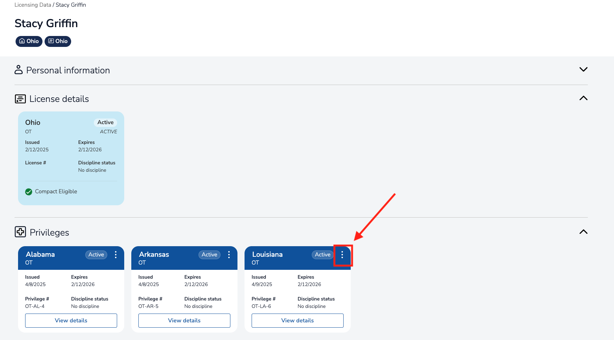
4. Select **"Deactivate"**
5. Complete the notes section explaining the reason for deactivation
6. Click the **"Deactivate Privilege"** button.

⚠️ **Important**: Deactivating privileges is different from encumbering them due to adverse actions. Encumbrance procedures are described below.

### Encumbering Privileges and Licenses
**This feature is only available to State Administrators (i.e., users with 'admin' role on a particular jurisdiction).**

#### Steps to Add an Encumbrance
1. Navigate to the practitioner's detail page (see [Practitioner Details](#practitioner-details-page))
2. Locate the privilege or license requiring encumbrance
3. Click the three-dot menu (⋮) in the top-right corner of the card

4. Select **"Encumber"**
5. Complete the encumbrance form with required information
6. If you are encumbering a privilege, there will be a button labeled **"Encumber Privilege"**. If you are encumbering a license, there will be a button labeled **"Encumber License"**. Select the button to finish placing the encumbrance.

#### Removing Encumbrances
To remove an existing encumbrance:
1. Navigate to the practitioner's detail page
2. Locate the encumbered privilege or license
3. Click the three-dot menu (⋮) in the top-right corner of the card
4. Select **"Remove Encumbrance"**
5. Complete the removal form
6. Click the **"Confirm Removal"** button.

---
